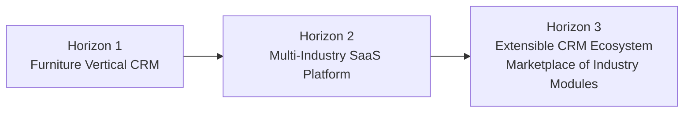

# PROJECT CONSTITUTION
## INAKARA CRM — Enterprise SaaS CRM Platform

**Status:** Ratified — Highest Authority Document
**Version:** 1.0.0
**Applies to:** Every human, AI agent, contributor, and future maintainer of this project

> This Constitution is the supreme source of truth for INAKARA CRM. No document, decision, pull request, or AI-generated output may contradict it. Where any conflict arises between this Constitution and any other document (including the `.ai/` foundation), **this Constitution wins**.

---

## Table of Contents

1. [Purpose](#1-purpose)
2. [Objectives](#2-objectives)
3. [Scope](#3-scope)
4. [Product Philosophy](#4-product-philosophy)
5. [Engineering Philosophy](#5-engineering-philosophy)
6. [Architecture Philosophy](#6-architecture-philosophy)
7. [Design Philosophy](#7-design-philosophy)
8. [Documentation Philosophy](#8-documentation-philosophy)
9. [Coding Philosophy](#9-coding-philosophy)
10. [Security Philosophy](#10-security-philosophy)
11. [Scalability Principles](#11-scalability-principles)
12. [Maintainability Principles](#12-maintainability-principles)
13. [Decision-Making Principles](#13-decision-making-principles)
14. [Long-Term Vision](#14-long-term-vision)
15. [Governance & Amendment Process](#15-governance--amendment-process)
16. [Glossary](#16-glossary)
17. [References](#17-references)

---

## 1. Purpose

INAKARA CRM exists to become a **professional, enterprise-grade SaaS CRM platform**, built first for the furniture manufacturing, retail, and sales industry, but architected from day one to expand into other industries without requiring a rewrite.

This Constitution exists to guarantee that every decision made — today or five years from now, by a human or an AI — is made with the same philosophy, the same standards, and the same long-term discipline.

## 2. Objectives

| Objective | Description |
|---|---|
| **O1. Single Source of Truth** | Establish one authoritative reference that all engineering, design, and product decisions must trace back to. |
| **O2. Consistency at Scale** | Ensure that as the team, codebase, and AI-assisted contributions grow, quality and philosophy remain uniform. |
| **O3. Industry-Agnostic Core** | Guarantee the platform's core is never hard-coded to furniture-specific assumptions. |
| **O4. Enterprise Credibility** | Build a product that feels, behaves, and performs like software from Stripe, Linear, or Attio — not a generic admin panel. |
| **O5. Sustainable Velocity** | Optimize for the ability to move fast in year 3 and year 5, not just week 1. |

## 3. Scope

This Constitution governs:

- Product decisions (what INAKARA CRM is and is not)
- Engineering decisions (how it is built)
- Architectural decisions (how it is structured)
- Design decisions (how it looks and feels)
- Documentation decisions (how knowledge is preserved)
- Security and data-handling decisions
- All current and future `.ai/` foundation documents

This Constitution does **not** dictate specific implementation code, specific library versions beyond the approved tech stack, or day-to-day task management. Those belong to subordinate documents in `.ai/`.

---

## 4. Product Philosophy

1. **INAKARA CRM is a platform, not a project.** Every feature must be built as if it will be sold, licensed, and multi-tenanted — even before multi-tenancy is implemented.
2. **Furniture is the first customer, not the only customer.** Domain-specific logic (BOM, SKU, showroom, production orders) must be treated as a *vertical module*, never baked into the generic core.
3. **Data density over decoration.** CRM users are professionals doing repetitive, high-volume work. The product must respect their time.
4. **Every entity is relational by default.** Contacts, companies, deals, products, and activities must always be designed with CRM-grade relational integrity (à la HubSpot/Attio), not simple CRUD tables.
5. **The product must never feel like a generated admin panel.** It must feel deliberately designed, calm, and trustworthy.

## 5. Engineering Philosophy

1. **Documentation precedes code.** No significant feature is built without a corresponding design/architecture document.
2. **Business-Driven Development.** Every technical decision must be traceable to a business reason, not personal preference.
3. **Architecture before code, always.** Structure is decided before implementation begins.
4. **Feature-First Architecture.** Code is organized by business capability (e.g. `deals`, `contacts`, `production`), not by technical layer alone.
5. **Boring technology by default.** New dependencies must justify their existence against the approved stack before adoption.
6. **AI is a team member, not an oracle.** AI-generated output is always subject to the same standards, review, and rules as human-generated output — no exceptions.

## 6. Architecture Philosophy

1. **Clean Architecture boundaries are non-negotiable.** Domain logic must never depend on framework internals (Laravel, Inertia, React) directly.
2. **Feature-Based + Clean Architecture hybrid.** Features are the organizing unit; within each feature, clean layering (domain → application → infrastructure → presentation) is enforced.
3. **Desktop-first, responsive-always.** Primary design target is desktop (CRM is a workday tool), but the system must degrade gracefully to smaller viewports.
4. **Multi-industry extensibility is a first-class architectural constraint**, not an afterthought. Any core schema or module design must pass the question: *"Would this break if the next customer were a clinic instead of a furniture company?"*
5. **Vertical modules are isolated.** Industry-specific logic (e.g., furniture BOM) lives in its own module boundary and can be disabled without breaking the core CRM.
6. **No architectural decision is permanent without documentation.** Every significant architecture decision must be recorded with rationale (see `10-workflow.md` for ADR process once created).

## 7. Design Philosophy

1. **Minimal, Professional, Elegant, Modern, Calm, Readable, Enterprise.** These seven words are the permanent design test for every screen shipped.
2. **Limited color palette.** Color is used to communicate meaning (status, priority, alerts) — never for decoration.
3. **Typography-first, whitespace-first.** Hierarchy is achieved through type scale and spacing before it is achieved through color or borders.
4. **High information density, low visual noise.** Dense does not mean cluttered; every pixel must earn its place.
5. **Consistency over novelty.** A new screen should feel like it was designed by the same person who designed every other screen.
6. **Design inspiration, not design imitation.** HubSpot, Attio, Stripe Dashboard, Linear, Vercel, Notion, and Pipedrive inform the *quality bar*, not the visual identity. INAKARA CRM must never be a visual clone of any of them.

## 8. Documentation Philosophy

1. **If it is not documented, it does not exist.** Undocumented decisions carry no authority and can be overturned without discussion.
2. **Documentation is a permanent engineering artifact**, held to the same quality bar as production code.
3. **Every document must be self-contained enough** that a new engineer (human or AI) can act correctly using only that document and this Constitution.
4. **Documentation is versioned and living**, but changes must go through the Amendment Process defined in Section 15 when they affect binding rules.

## 9. Coding Philosophy

1. **SOLID, DRY, KISS** are the default lenses for every code review, human or AI-assisted.
2. **Single Responsibility at every layer** — from a single React component to a single Laravel service class.
3. **Reusability is designed, not discovered.** Shared components/modules are planned proactively based on documented domain modeling, not extracted reactively after duplication.
4. **Explicit over clever.** Code must optimize for the next reader's understanding, not the current author's elegance.
5. **No implementation begins without this Constitution and the relevant `.ai/` rule files being followed.**

## 10. Security Philosophy

1. **Security is a default state, not a feature.** Authentication, authorization (Spatie Laravel Permission), and data isolation must be considered in every feature from its first design draft.
2. **Least privilege by default.** Roles and permissions are additive and explicit; nothing is accessible by default without a defined permission.
3. **Customer data is sacred.** CRM data (contacts, deals, financials) is treated with the same seriousness as regulated data, regardless of current legal requirement.
4. **Security rules are detailed in `12-security-rules.md`**, but the *principle* of security-by-default is constitutional and cannot be weakened by any subordinate document.

## 11. Scalability Principles

1. **Scale in three dimensions:** data volume (enterprise-scale records), team size (more engineers, more AI agents), and industry breadth (more verticals).
2. **The core schema must never assume furniture-only fields.** Industry-specific attributes are extended, not hard-coded (see `14-multi-industry-strategy.md`).
3. **Horizontal feature growth must not increase coupling.** Adding a new feature module should not require modifying unrelated modules.
4. **Performance is a feature.** Enterprise data density must remain fast; this is validated, not assumed.

## 12. Maintainability Principles

1. **Optimize for the third year, not the third day.** Every shortcut must be consciously justified against long-term cost.
2. **Consistency is enforced structurally**, not through goodwill — via coding standards, linting, and documented conventions.
3. **No orphaned code.** Every module, component, and service must be traceable to a documented feature and owner.
4. **Refactoring is a normal, expected activity**, not a sign of failure — provided it is documented and does not violate this Constitution.

## 13. Decision-Making Principles

1. **Every decision has a trace.** Business reason → Documented rule → Implementation.
2. **When in doubt, favor the option that is more industry-agnostic, more explicit, and more consistent with existing patterns.**
3. **Disagreements are resolved by referring up the authority chain:** Implementation detail → Feature rule (`.ai/`) → This Constitution.
4. **No individual contributor, including AI, may unilaterally override this Constitution.** Amendments follow Section 15.

## 14. Long-Term Vision

INAKARA CRM is designed to evolve through three horizons:

- **Horizon 1 — Furniture Vertical CRM:** Prove product-market fit with a deeply useful, professional CRM for furniture manufacturing, retail, and sales.
- **Horizon 2 — Multi-Industry SaaS Platform:** Generalize the core so new industries can be onboarded via configuration and vertical modules, not rewrites.
- **Horizon 3 — Extensible CRM Ecosystem:** Enable a modular, potentially marketplace-driven system where industry modules, integrations, and customizations can be composed on top of a stable core.

Every architectural and product decision made today must remain compatible with reaching Horizon 3.

---

## 15. Governance & Amendment Process

1. This Constitution may only be amended through a deliberate, documented decision — never silently edited.
2. Any amendment must include: the rule being changed, the rationale, and the impact on existing `.ai/` documents.
3. Subordinate documents (`.ai/*.md`) must always be read as *implementations* of this Constitution. If a subordinate document contradicts this Constitution, the subordinate document is wrong and must be corrected.
4. Version history of this Constitution must be preserved (see Decision Notes below).

### Decision Notes

| Version | Date | Change | Rationale |
|---|---|---|---|
| 1.0.0 | Initial ratification | Constitution established | Foundation for all future INAKARA CRM decisions |

---

## 16. Glossary

| Term | Definition |
|---|---|
| **Constitution** | This document; the highest authority governing the project. |
| **`.ai/` Foundation** | The set of subordinate rule documents that implement this Constitution in specific domains (frontend, backend, design, etc.). |
| **Vertical Module** | A self-contained set of features/logic specific to one industry (e.g., furniture BOM management). |
| **Core** | The industry-agnostic foundation of the CRM (contacts, companies, deals, pipelines, activities). |
| **Horizon** | A long-term strategic phase in the product's evolution (see Section 14). |
| **ADR** | Architecture Decision Record — a documented rationale for a significant architectural choice. |

## 17. References

- `.ai/00-master-prompt.md` — how all future AI sessions must interpret this Constitution
- `.ai/01-project-rules.md` through `.ai/15-glossary.md` — subordinate implementation rules
- Design inspiration references: HubSpot, Attio, Stripe Dashboard, Linear, Vercel Dashboard, Notion, Pipedrive (philosophy only, not visual reference)

---

*End of PROJECT_CONSTITUTION.md — Version 1.0.0*
