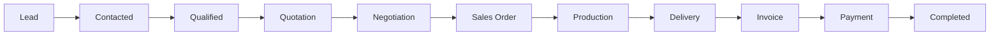

# 01. Product Rules
## INAKARA CRM — Business Rules Reference

**Status:** Binding — Subordinate to `PROJECT_CONSTITUTION.md`
**Version:** 1.0.0
**Scope:** This document defines business rules only. It contains no technical implementation, no database design, no API design, and no UI design.

---

## Table of Contents

1. [Product Overview](#1-product-overview)
2. [Product Principles](#2-product-principles)
3. [CRM Workflow](#3-crm-workflow)
4. [Business Rules](#4-business-rules)
5. [Lead Rules](#5-lead-rules)
6. [Customer Rules](#6-customer-rules)
7. [Sales Pipeline Rules](#7-sales-pipeline-rules)
8. [User Role Rules](#8-user-role-rules)
9. [Notification Rules](#9-notification-rules)
10. [Activity Timeline Rules](#10-activity-timeline-rules)
11. [Audit Rules](#11-audit-rules)
12. [Dashboard Rules](#12-dashboard-rules)
13. [Report Rules](#13-report-rules)
14. [Global Rules](#14-global-rules)
15. [Future Expansion](#15-future-expansion)
16. [Glossary](#16-glossary)
17. [References](#17-references)

---

## 1. Product Overview

### 1.1 Purpose

INAKARA CRM exists to give furniture manufacturing, retail, and sales organizations a single, professional system to manage the entire commercial lifecycle — from the first contact with a prospective buyer to final payment and project completion.

### 1.2 Problem Being Solved

Furniture businesses commonly manage sales through fragmented tools: spreadsheets for leads, chat apps for follow-up, paper for quotations, and manual coordination between sales, production, and finance. This fragmentation causes lost leads, inconsistent pricing, missed follow-ups, delayed production handoffs, and no single source of truth for customer history. INAKARA CRM consolidates this into one governed system.

### 1.3 Target Users

- Business owners who need visibility into the full sales and production pipeline.
- Sales managers who need to allocate leads, monitor pipeline health, and enforce process discipline.
- Sales representatives who need a fast, low-friction tool to manage leads, quotations, and follow-ups.
- Finance staff who need accurate, auditable records of invoices and payments.
- Warehouse and production staff who need clear visibility into confirmed orders awaiting fulfillment.
- Customer service staff who need full customer history to resolve inquiries and complaints.

### 1.4 Target Industry

The first implementation targets furniture manufacturing, furniture retail, and furniture sales organizations, covering custom-made and ready-made product sales.

### 1.5 Product Vision

INAKARA CRM will become the CRM platform of choice for order-driven, production-linked sales businesses — starting with furniture and expanding to any industry where a sale must be tracked from lead through delivery and payment.

### 1.6 Product Mission

To give every business role — from owner to warehouse staff — one accurate, real-time view of every customer relationship and every transaction, without requiring a rebuild when the business changes or grows into a new industry.

---

## 2. Product Principles

| Principle | Meaning | Rationale |
|---|---|---|
| **Simple** | Every screen and workflow does one thing clearly. | Sales staff work under time pressure; complexity causes abandonment and data entry errors. |
| **Fast** | The system responds and updates without perceptible delay. | Slow tools get bypassed by spreadsheets and chat apps, defeating the purpose of a CRM. |
| **Scalable** | The system supports growth in data volume, users, and industries without redesign. | The product must serve a 5-person furniture shop and a multi-branch enterprise on the same foundation. |
| **Secure** | Access and data are protected by default, not by afterthought. | CRM data includes customer financial and contact information that must be protected at all times. |
| **Audit Friendly** | Every meaningful change is traceable to a person, time, and reason. | Sales, finance, and production disputes must be resolvable by reviewing system history, not memory. |
| **Modular** | Business capabilities are separable and independently extendable. | New industries and new workflows must be addable without breaking existing ones. |
| **Enterprise Ready** | The product behaves predictably, consistently, and professionally at scale. | The system must be trustworthy enough to run a company's entire revenue process. |
| **Process Consistent** | The same business event always produces the same system behavior. | Predictability is what allows staff, managers, and auditors to trust the system. |
| **Data Complete** | No sales-relevant fact is lost between stages. | Losing information between Lead, Quotation, and Sales Order breaks trust in the CRM as the single source of truth. |
| **Industry Neutral at the Core** | Core business objects never assume furniture-only characteristics. | This is required to reach the long-term multi-industry vision without an architectural rewrite. |

---

## 3. CRM Workflow

### 3.1 Primary Sales-to-Cash Workflow

### 3.2 Stage Purpose

| Stage | Purpose |
|---|---|
| **Lead** | Capture a prospective buyer before any qualification has occurred. |
| **Contacted** | Confirm that the sales representative has made initial contact. |
| **Qualified** | Confirm the lead has a genuine need, budget indication, and buying intent. |
| **Quotation** | Formal pricing and product proposal has been issued to the prospect. |
| **Negotiation** | Terms, pricing, or specifications are being actively discussed and revised. |
| **Sales Order** | The customer has committed to purchase; order terms are locked. |
| **Production** | Goods that require manufacturing are being produced against the confirmed order. |
| **Delivery** | Goods are dispatched and confirmed received by the customer. |
| **Invoice** | A formal payment request has been issued for delivered or deliverable goods. |
| **Payment** | Customer funds are being collected against the invoice, in full or in installments. |
| **Completed** | All obligations — production, delivery, invoicing, and payment — are fulfilled. |

### 3.3 Non-Linear Realities

A Deal may move backward (e.g., Negotiation back to Quotation) or branch (e.g., partial delivery, partial payment). The workflow above defines the intended forward path; Section 4 and Section 7 define the rules governing exceptions.

---

## 4. Business Rules

Business rules are grouped by domain. Each rule is permanent unless formally amended per the Constitution's governance process.

### 4.1 Lead-to-Customer Rules

1. A Lead cannot become a Customer without an associated Deal marked as Won.
2. A Lead may exist without an assigned Sales representative, but cannot advance past "Contacted" without one.
3. A Lead must have at minimum a name and one verified contact method (phone or email) before it can be marked "Qualified".
4. A Lead may be converted from any source (referral, marketing, walk-in, phone, digital channel, event).
5. A Lead may be merged with another Lead if identified as a duplicate, preserving the earliest creation date.
6. A Lead may be disqualified at any stage with a mandatory disqualification reason.
7. A disqualified Lead may be reopened only by a Sales Manager or Owner.
8. A Lead cannot be deleted; it may only be archived or disqualified.
9. Every Lead must have exactly one owner (assigned Sales representative) at any point in time.
10. Lead ownership can be reassigned only by a Sales Manager or Owner, and the reassignment must be recorded.

### 4.2 Customer Rules

11. A Customer record is created automatically and only when a Deal is marked Won.
12. A Customer may have multiple Deals, historical and active, over its lifetime.
13. A Customer may have multiple Quotations, only one of which may be linked to an active Sales Order per Deal.
14. A Customer cannot be deleted if it has any associated Deal, Invoice, or Payment history; it may only be archived.
15. A Customer record must retain a complete history of all associated Leads, Deals, Quotations, Sales Orders, Invoices, and Payments.
16. A Customer may be an individual or an organization; both must be supported without separate systems.
17. A Customer may have multiple contact persons, with one marked as primary.
18. Customer credit terms (if applicable) must be explicitly defined and are not inferred from past behavior automatically.
19. A Customer flagged as high-risk or blacklisted must trigger a warning before a new Deal can be created.
20. Removing a blacklist flag requires approval from Finance or Owner.

### 4.3 Quotation Rules

21. A Quotation cannot be created without a Qualified Lead or existing Customer.
22. A Quotation must have a defined validity period (expiry date).
23. An expired Quotation cannot be converted directly into a Sales Order without revalidation.
24. A Quotation may have multiple revisions; each revision must be versioned and retained, not overwritten.
25. Only the latest active Quotation revision may be converted into a Sales Order.
26. A Quotation must specify currency, tax treatment, and total price before it can be sent to a customer.
27. A Quotation sent to a customer cannot be silently edited; changes require a new revision.
28. A Quotation may include custom, made-to-order items requiring specification details distinct from standard catalog items.
29. Quotation discounts beyond a defined threshold require approval from a Sales Manager.
30. A Quotation must record who created it, who approved it (if applicable), and when it was sent.

### 4.4 Negotiation Rules

31. Negotiation changes (price, terms, specification) must be recorded as part of the Deal history, not lost.
32. A Deal may cycle between Quotation and Negotiation multiple times before resolution.
33. Negotiation cannot alter a Sales Order once the Sales Order has been confirmed; a new Sales Order revision or Change Order is required instead.
34. Verbal negotiation outcomes must be logged in the system before they are considered valid for order processing.

### 4.5 Sales Order Rules

35. A Sales Order cannot be created without a Won Deal and an approved Quotation.
36. A Sales Order locks pricing, product specification, and quantity at the point of confirmation.
37. Changes to a confirmed Sales Order must go through a formal Change Order process, not direct editing.
38. A Sales Order must specify expected delivery terms before confirmation.
39. A Sales Order cannot be cancelled once Production has started without Manager or Owner approval.
40. A cancelled Sales Order must record a cancellation reason and be retained for audit and reporting purposes.

### 4.6 Production Rules

41. Production cannot begin without a confirmed Sales Order.
42. Production status must be tracked at a level that allows Sales and Customer Service to answer customer status inquiries without contacting the production floor directly.
43. A Sales Order requiring custom manufacturing must not be marked "Ready for Delivery" until Production explicitly confirms completion.
44. Production delays that affect the promised delivery date must trigger a notification to the responsible Sales representative.
45. Partial production completion (e.g., staged manufacturing for large orders) must be supported and reflected accurately in order status.

### 4.7 Delivery Rules

46. Delivery cannot be scheduled or performed before Production confirms the relevant goods are complete, unless the Sales Order contains only ready-stock items.
47. Delivery must be confirmed by an explicit acknowledgment (customer signature, confirmation code, or equivalent) before the order is marked "Delivered".
48. Partial deliveries are permitted and must be tracked against the remaining undelivered quantity of the Sales Order.
49. A Sales Order is not eligible for full completion until all line items are delivered or explicitly waived.
50. Failed or refused deliveries must be logged with a reason and trigger a follow-up task.

### 4.8 Invoice Rules

51. An Invoice cannot be created without a confirmed Sales Order.
52. An Invoice may be created before, during, or after Delivery depending on the agreed payment terms, but this must be explicit per Sales Order, not assumed.
53. An Invoice amount cannot exceed the total value of its associated Sales Order, including approved Change Orders.
54. An Invoice may be split into multiple partial invoices against a single Sales Order, provided the sum does not exceed the order total.
55. An Invoice cannot be edited after issuance; corrections require a Credit Note or a new Invoice.
56. Every Invoice must have a unique, sequential, non-reusable reference number.
57. An Invoice must clearly state due date, tax breakdown, and payment instructions.

### 4.9 Payment Rules

58. Payment can be made in full or in installments against an Invoice.
59. A Payment cannot be recorded against a non-existent or cancelled Invoice.
60. The sum of all Payments against an Invoice cannot exceed the Invoice total.
61. Overpayment must be flagged and requires Finance approval to resolve (refund or credit to future invoice).
62. Each Payment must record method, date, amount, and the staff member who recorded it.
63. A Sales Order is not eligible for "Completed" status until all associated Invoices are fully paid, unless explicitly waived by Finance or Owner.
64. Overdue Payments must be identifiable in the system without manual calculation.

### 4.10 Deal & Pipeline Integrity Rules

65. A Deal must always belong to exactly one pipeline stage at any given time.
66. A Deal cannot skip mandatory stages (e.g., Lead directly to Sales Order) without a documented exception reason and Manager approval.
67. A Deal marked "Lost" must record a loss reason from a controlled list.
68. A Lost Deal may be reopened only with Manager or Owner approval, and the reopening must be logged.
69. Every Deal must have exactly one responsible owner at all times.
70. Deal value must be defined before the Deal can progress beyond "Qualified".

### 4.11 Ownership, Assignment & Escalation Rules

71. Every Lead, Deal, and Customer must have a single accountable owner at all times; unassigned records are not permitted beyond the initial creation state.
72. Reassignment of ownership must preserve the full history under the previous owner.
73. A Lead untouched (no activity) beyond a defined threshold must be escalated to the Sales Manager.
74. An overdue follow-up must escalate visibility to the assigned representative's manager after a defined grace period.

### 4.12 Financial Consistency Rules

75. Currency for a Deal, Quotation, Sales Order, and Invoice chain must remain consistent throughout unless an explicit, approved currency conversion is recorded.
76. Tax rules applied at Quotation stage must carry through to Invoice unless a documented tax change justifies recalculation.
77. Discounts must always be traceable to an approval record if they exceed the standard authority of the requesting role.
78. Financial totals displayed anywhere in the system (dashboard, report, document) must always be derivable from the underlying transactional records, never manually overridden.

### 4.13 Data Integrity Rules

79. No record central to the sales process (Lead, Customer, Deal, Quotation, Sales Order, Invoice, Payment) may be permanently deleted; all use soft-delete/archival.
80. Every status change on a core object must be timestamped and attributed to a user.
81. Historical documents (Quotations, Invoices) must remain viewable in the exact state they were issued, even after later revisions or price list changes.
82. Any manual override of a system-calculated value (e.g., total price) must require a reason and elevated approval.

### 4.14 Process Governance Rules

83. No stage transition in the sales-to-cash workflow may be performed by a role not authorized for that transition (see Section 8).
84. Every exception to standard workflow (skipped stage, backward movement, override) must be logged with a reason.
85. Business rule exceptions require a role with explicit authority (Sales Manager, Finance, or Owner) — a Sales representative alone cannot override financial or process controls.

### 4.15 Multi-Industry Neutrality Rules

86. No business rule in this document may reference furniture-specific terminology as a hard requirement; furniture-specific vocabulary (e.g., "showroom", "Bill of Materials") is treated as an industry configuration, not a core rule.
87. Any future industry implementation must be able to reuse Sections 4.1 through 4.14 without modification; only industry-specific extensions are added, never core replacements.
88. Product catalog structure must support both stocked and made-to-order items generically, not only furniture-style custom manufacturing.

### 4.16 Additional Cross-Cutting Rules

89. A Deal cannot be marked "Completed" while any linked Invoice remains unpaid, unless explicitly waived with recorded justification.
90. A Customer's outstanding balance must always be viewable as a single, current, accurate figure derived from live data.
91. A Sales representative cannot approve their own discount or quotation exception beyond their defined authority.
92. Every notification-triggering event (Section 9) must have a defined recipient role, not an arbitrary user.
93. Every report (Section 13) must be reproducible for any historical date range using retained historical data, not only current-state data.
94. Dashboard KPIs must be defined per role and must not expose data outside that role's business responsibility (e.g., Warehouse does not see customer pricing negotiation history).
95. A cancelled or lost Deal must remain queryable for reporting (conversion rate, loss reason analysis) indefinitely.
96. Any manual data import (e.g., bulk lead import) must go through the same validation rules as manually created records.
97. Any exported data (Section 14) must reflect the same business rules and access restrictions as the live system.
98. A Change Order affecting price or scope after Sales Order confirmation must be approved by the same authority level required for the original discount or exception.
99. System-generated numbering (Quotation number, Sales Order number, Invoice number) must never be reused, even if the original record is cancelled or archived.
100. Every business rule in this document is binding for every future industry vertical unless explicitly superseded by a documented industry-specific rule that does not contradict the Constitution.
101. A Lead, once qualified, cannot revert to "unqualified" status; it may only be disqualified with a reason, preserving that it once reached Qualified.
102. Any staff member terminating employment or losing system access must have their assigned Leads, Deals, and Customers reassigned before access is revoked.
103. Follow-up activity on any Lead or Deal must never lapse silently; the absence of a scheduled next action is itself a flagged condition (see Section 9).
104. All monetary values in the system must be stored and displayed with an explicit currency at all times; no monetary value may exist without a defined currency context.

---

## 5. Lead Rules

### 5.1 Lifecycle

A Lead progresses through: **New → Contacted → Qualified → Disqualified (terminal, reopenable) or converted into a Deal**.

### 5.2 Validation Rules

- A Lead must have a name and at least one contact method before creation is finalized.
- Duplicate detection must be checked against existing Leads and Customers using contact method matching before a new Lead is created.

### 5.3 Status Transition Rules

| From | To | Requirement |
|---|---|---|
| New | Contacted | At least one logged contact attempt. |
| Contacted | Qualified | Confirmed need, indicative budget, and buying intent recorded. |
| Contacted | Disqualified | Reason recorded. |
| Qualified | Disqualified | Reason recorded; Qualified history preserved. |
| Qualified | Deal Created | A Deal is opened, linked to this Lead. |
| Disqualified | Contacted/Qualified | Manager or Owner approval required to reopen. |

### 5.4 Ownership Rules

- Every Lead has exactly one owner at all times.
- Unassigned Leads must be visible on a distinct "unassigned" queue for the Sales Manager.

### 5.5 Assignment Rules

- Leads may be assigned manually by a Sales Manager or automatically by a defined distribution rule (e.g., round robin, territory, source-based).
- Reassignment must preserve prior ownership history.

### 5.6 Follow-Up Rules

- Every Lead in "Contacted" or "Qualified" status must have a scheduled next follow-up action at all times.
- A Lead without a scheduled next action is considered at-risk and must be surfaced to the owner and, if overdue, to the Sales Manager.

### 5.7 Reminder Rules

- Reminders must be generated ahead of a scheduled follow-up, not only at the moment it becomes overdue.
- A missed follow-up must generate an overdue reminder, distinct in urgency from an upcoming reminder.

---

## 6. Customer Rules

### 6.1 Relationship to Lead

A Customer originates from exactly one converted Lead (the Lead whose Deal was Won), but may accumulate additional Leads over time, all linked to the same Customer record.

### 6.2 Relationship to Quotation

All Quotations issued to a Customer, across all Deals, must be visible in a single consolidated Customer history.

### 6.3 Relationship to Deal

A Customer may have multiple concurrent or sequential Deals; each Deal is independently tracked through the pipeline.

### 6.4 Relationship to Invoice

All Invoices issued to a Customer must be visible in a single consolidated view showing paid, partially paid, and outstanding status.

### 6.5 Relationship to Project

Where a Sales Order requires ongoing production or multi-phase delivery, it is treated as a Project association under the Customer, retaining production and delivery milestones.

### 6.6 Relationship to History

A Customer record is the permanent aggregation point for all Lead, Deal, Quotation, Sales Order, Invoice, Payment, and Activity Timeline data associated with that Customer, retained indefinitely.

---

## 7. Sales Pipeline Rules

| Stage | Purpose | Entry Criteria | Exit Criteria | Responsible Role |
|---|---|---|---|---|
| **Lead** | Capture unqualified prospect | Contact information captured | Initial contact logged | Sales |
| **Contacted** | Confirm engagement has begun | At least one contact attempt logged | Need, budget, and intent identified | Sales |
| **Qualified** | Confirm the opportunity is real | Need/budget/intent confirmed | Quotation prepared | Sales |
| **Quotation** | Formal proposal issued | Quotation drafted and validated | Quotation sent to customer | Sales |
| **Negotiation** | Resolve terms and pricing | Customer feedback received | Terms agreed by both parties | Sales / Sales Manager (for exceptions) |
| **Sales Order** | Lock commitment | Deal marked Won, Quotation approved | Order confirmed and locked | Sales Manager |
| **Production** | Manufacture ordered goods | Sales Order confirmed | Production completion confirmed | Production |
| **Delivery** | Fulfill the order | Goods ready for dispatch | Delivery confirmed by customer | Warehouse |
| **Invoice** | Request payment | Delivery milestone reached (per terms) | Invoice issued | Finance |
| **Payment** | Collect funds | Invoice issued | Full payment received | Finance |
| **Completed** | Close the Deal | All prior stages satisfied | N/A — terminal state | System / Sales Manager |

---

## 8. User Role Rules

| Role | Business Responsibility |
|---|---|
| **Owner** | Holds ultimate accountability for the business outcome of the CRM; can override any process exception; reviews company-wide performance. |
| **Sales Manager** | Owns pipeline health and team performance; assigns and reassigns Leads and Deals; approves discounts and exceptions beyond individual Sales authority; approves reopening of disqualified Leads or lost Deals. |
| **Sales** | Owns individual Leads and Deals from Contact through Sales Order; responsible for timely follow-up, accurate Quotations, and honest pipeline status. |
| **Finance** | Owns Invoice issuance, Payment recording, credit terms enforcement, and resolution of overpayment or blacklist status; accountable for financial accuracy. |
| **Warehouse** | Owns delivery execution and confirmation; responsible for accurate stock and delivery status visibility. |
| **Production** | Owns manufacturing execution against confirmed Sales Orders; responsible for timely status updates affecting delivery promises. |
| **Customer Service** | Owns post-sale customer inquiries and issue resolution; relies on complete Customer history to respond accurately without escalation for basic inquiries. |

Future roles must be defined with the same structure: business responsibility first, technical permission second.

---

## 9. Notification Rules

| Notification | Trigger | Recipient |
|---|---|---|
| Follow-up due | Scheduled follow-up date reached | Lead/Deal owner |
| Follow-up overdue | Follow-up date passed without action | Lead/Deal owner, then Sales Manager |
| Quotation expiring soon | Quotation approaching validity expiry | Lead/Deal owner |
| Quotation expired | Validity period passed without conversion | Lead/Deal owner, Sales Manager |
| Invoice due soon | Invoice due date approaching | Finance, Customer-facing owner |
| Invoice overdue | Due date passed without full payment | Finance, Sales Manager |
| Payment received | Payment recorded against Invoice | Finance, Deal owner |
| Production delay | Production milestone missed | Deal owner, Sales Manager |
| Production completed | Production marked complete | Warehouse, Deal owner |
| Delivery scheduled | Delivery date set | Customer-facing owner, Warehouse |
| Delivery completed | Delivery confirmed | Deal owner, Finance (if invoice pending) |
| Sales target milestone | Defined target threshold reached or missed | Sales, Sales Manager, Owner |
| New customer created | Deal marked Won | Sales Manager, Customer Service |
| Unassigned Lead aging | Lead unassigned beyond threshold | Sales Manager |

---

## 10. Activity Timeline Rules

Every business-significant event must be recorded on the relevant Lead, Deal, or Customer timeline, including but not limited to:

- Lead created, modified, reassigned, disqualified, or reopened.
- Contact attempt logged (call, email, meeting, message).
- Qualification status changed.
- Quotation created, revised, sent, expired, or converted.
- Negotiation terms changed.
- Sales Order created, confirmed, changed, or cancelled.
- Production status changed.
- Delivery scheduled, partially completed, completed, or failed.
- Invoice created, issued, or corrected.
- Payment received, partial or full.
- Deal marked Won, Lost, or Completed.

Timeline entries are permanent, chronological, and never edited retroactively; corrections are added as new entries, never as edits to history.

---

## 11. Audit Rules

Every change to a core business object (Lead, Customer, Deal, Quotation, Sales Order, Invoice, Payment) must record:

- **Who** performed the change (identified user, not a shared account).
- **When** the change occurred (exact timestamp).
- **Where** the change originated (source IP or equivalent access context).
- **What** changed (the specific field or state transition).
- **Before and after values** (old data and new data).
- **Why**, when the change is an exception, override, or correction (mandatory reason field).

Audit records are immutable and retained indefinitely; they are never deleted, even when the underlying record is archived.

---

## 12. Dashboard Rules

| Dashboard | Primary KPIs |
|---|---|
| **Owner Dashboard** | Company-wide revenue, pipeline value, conversion rate, overdue payments, team performance summary. |
| **Sales Manager Dashboard** | Team pipeline health, lead response time, conversion rate by representative, overdue follow-ups, quota attainment. |
| **Sales Dashboard** | Personal pipeline, upcoming follow-ups, quotation status, personal quota attainment. |
| **Finance Dashboard** | Outstanding invoices, overdue payments, cash collected, revenue recognized, blacklist/credit risk flags. |
| **Warehouse Dashboard** | Pending deliveries, delivery schedule, delivery exceptions/failures. |
| **Production Dashboard** | Production queue, orders at risk of delivery delay, completed vs. pending production. |
| **Customer Service Dashboard** | Open customer inquiries, customer history access, recent order/delivery/payment status per customer. |

Each dashboard exposes only data relevant to that role's business responsibility, per Rule 94.

---

## 13. Report Rules

| Report | Purpose |
|---|---|
| **Sales Report** | Performance by representative, team, and period. |
| **Revenue Report** | Realized and projected revenue over a defined period. |
| **Quotation Report** | Quotation volume, conversion rate, and expiry rate. |
| **Lead Conversion Report** | Conversion rate at each pipeline stage, by source and by owner. |
| **Pipeline Report** | Current distribution of open Deals by stage and value. |
| **Customer Report** | Customer acquisition, retention, and lifetime value. |
| **Inventory/Production Report** | Production throughput, backlog, and delay incidence. |
| **Payment Report** | Collected vs. outstanding, aging analysis, overdue accounts. |
| **Production Report** | Order fulfillment timelines and bottleneck analysis. |
| **Delivery Report** | On-time delivery rate, failed delivery incidence. |

All reports must be reproducible for any historical period using retained historical data (Rule 93).

---

## 14. Global Rules

- **Soft Delete:** No core business record is ever hard-deleted; all deletions are reversible archival actions.
- **Code Generator / Numbering:** All business documents (Lead reference, Quotation number, Sales Order number, Invoice number) use system-generated, sequential, non-reusable identifiers.
- **Timezone:** All timestamps are recorded in a consistent system timezone standard and displayed in the user's local context.
- **Currency:** Every monetary value carries an explicit currency at all times (Rule 104).
- **Tax:** Tax treatment is explicit and traceable from Quotation through Invoice.
- **Status:** Every core object has a single, unambiguous current status at all times.
- **History:** All status and value changes are retained as permanent history, never overwritten.
- **Search:** All core business objects must be discoverable through search by their key identifying attributes.
- **Filter:** All list views of core business objects must support filtering by status, owner, date range, and customer.
- **Sorting:** All list views must support sorting by relevant business fields (date, value, status).
- **Export:** Exported data must respect the same access and business rules as the source system (Rule 97).
- **Import:** Imported data undergoes the same validation as manually entered data (Rule 96).
- **Archive:** Archived records remain queryable for reporting and audit but are excluded from active operational views by default.
- **Restore:** Archived records may be restored by an authorized role, and the restoration itself is an audited event.

---

## 15. Future Expansion

The business rules in this document are written to remain valid, without modification, when INAKARA CRM is deployed for industries beyond furniture, including:

- **Distributor:** Lead-to-Sales Order flow applies unchanged; "Production" stage may be bypassed for pure distribution, using existing stock fulfillment instead.
- **Contractor:** "Production" is reinterpreted as project execution/service delivery; the same milestone and completion rules apply.
- **Retail:** The pipeline may be compressed (Lead through Sales Order occurring in a single interaction), while all business rules governing Invoice, Payment, and Customer history remain unchanged.
- **Manufacturing (non-furniture):** The Production stage rules apply directly; only the product specification detail differs, which is an industry configuration, not a core rule change.
- **Services:** "Delivery" is reinterpreted as service completion; "Production" may be renamed "Service Delivery" at the configuration level without altering the underlying rule.
- **Trading:** The full pipeline applies with "Production" typically skipped in favor of direct stock-based fulfillment.

In every case, expansion is achieved through industry-level configuration and vertical extension, never through modification of Sections 4 through 14 of this document.

---

## 16. Glossary

| Term | Definition |
|---|---|
| **Lead** | An unqualified or partially qualified prospective buyer. |
| **Deal** | A tracked sales opportunity progressing through the pipeline toward Won or Lost. |
| **Customer** | An entity created only upon a Won Deal, retaining full historical relationship data. |
| **Quotation** | A formal, versioned pricing and product proposal issued to a prospect or customer. |
| **Sales Order** | A confirmed, locked commercial commitment following a Won Deal and approved Quotation. |
| **Change Order** | A formally approved modification to a confirmed Sales Order. |
| **Production** | The manufacturing execution stage fulfilling a confirmed Sales Order. |
| **Delivery** | The fulfillment stage confirming goods have reached the customer. |
| **Invoice** | A formal, immutable payment request issued against a Sales Order. |
| **Payment** | A recorded transfer of funds against an Invoice, full or partial. |
| **Completed** | The terminal state confirming all obligations of a Deal are fulfilled. |
| **Activity Timeline** | The permanent, chronological record of business-significant events on a Lead, Deal, or Customer. |
| **Audit Log** | The immutable record of who changed what, when, and why, across core business objects. |

---

## 17. References

- `PROJECT_CONSTITUTION.md` — supreme authority governing this document.
- `.ai/00-master-prompt.md` — governs how this document is to be interpreted by future AI sessions.
- `.ai/14-multi-industry-strategy.md` — technical strategy supporting Section 15 of this document.

---

*End of 01-product-rules.md — Version 1.0.0*
