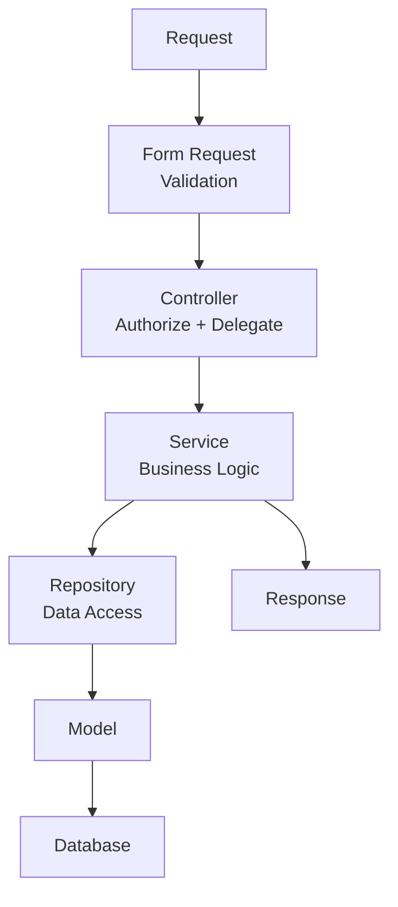

# Backend Architecture
## INAKARA CRM — Permanent Backend Engineering Standard

**Status:** Binding — Subordinate to `PROJECT_CONSTITUTION.md`, `01-product-rules.md`, `02-design-principles.md`, `03-design-system.md`, `frontend-architecture.md`
**Version:** 1.0.0
**Stack:** Laravel 13, PHP 8.3+, MySQL, Inertia.js, React, Spatie Permission, Laravel Excel, DomPDF, Laravel Fortify, Queue, Notification, Event, Policy, Form Request
**Scope:** This document defines backend architecture and engineering standards only. It contains no code, no migrations, no models, and no controllers.

---

## Table of Contents

1. [Backend Architecture Goals](#1-backend-architecture-goals)
2. [Folder Structure](#2-folder-structure)
3. [Layer Architecture](#3-layer-architecture)
4. [Controller Rules](#4-controller-rules)
5. [Service Layer](#5-service-layer)
6. [Repository Pattern](#6-repository-pattern)
7. [Model Rules](#7-model-rules)
8. [Validation Rules](#8-validation-rules)
9. [Authorization](#9-authorization)
10. [Role Structure](#10-role-structure)
11. [Business Modules](#11-business-modules)
12. [Database Transaction](#12-database-transaction)
13. [Event Driven](#13-event-driven)
14. [Queue](#14-queue)
15. [Notification](#15-notification)
16. [Exception Handling](#16-exception-handling)
17. [API Response Standard](#17-api-response-standard)
18. [Logging](#18-logging)
19. [Performance](#19-performance)
20. [Caching Strategy](#20-caching-strategy)
21. [File Upload](#21-file-upload)
22. [Export & Import](#22-export--import)
23. [PDF Standard](#23-pdf-standard)
24. [Coding Standard](#24-coding-standard)
25. [Dependency Rule](#25-dependency-rule)
26. [Naming Convention](#26-naming-convention)
27. [Testing Strategy](#27-testing-strategy)
28. [Future Scalability](#28-future-scalability)
29. [Security Standard](#29-security-standard)
30. [Best Practices](#30-best-practices)
31. [Glossary](#31-glossary)
32. [References](#32-references)

---

## 1. Backend Architecture Goals

The backend architecture exists to keep business logic correct, auditable, and stable as INAKARA CRM grows across features, roles, branches, companies, and eventually industries. Every structural decision serves the following philosophy:

| Goal | Meaning |
|---|---|
| **Maintainability** | Any engineer can locate, understand, and safely modify a piece of business logic without side effects elsewhere. |
| **Scalability** | The architecture supports growing data volume, growing team size, and growing business scope without redesign. |
| **Testability** | Business logic is isolated in layers that can be tested independently of HTTP, database, or UI concerns. |
| **Clean Architecture** | Dependencies point inward — framework and infrastructure concerns never leak into core business rules. |
| **Modular** | Business capabilities (Section 11) are separated into clear boundaries, mirroring the frontend's feature-first structure. |
| **Reusable** | Business logic is written once, in Services, and reused across web requests, queued jobs, commands, and future API consumers. |
| **SOLID** | Every class has a single, well-defined responsibility, and depends on abstractions rather than concrete implementations where extension is anticipated. |
| **DRY** | No business rule is implemented in more than one place. |
| **KISS** | Complexity is only introduced where the business problem genuinely requires it. |

---

## 2. Folder Structure

The following structure is the permanent, binding layout for the `app/` backend source tree.

```
app/
  Actions/            → Single-purpose, invokable business operations (e.g., ApproveQuotationAction)
  Services/            → Business logic orchestration per module (Section 5)
  Repositories/        → Data access and complex queries per module (Section 6)
  DTO/                 → Data Transfer Objects passed between layers
  Enums/               → Status, role, and other fixed-value definitions
  Events/              → Domain events (Section 13)
  Listeners/           → Event listeners/handlers
  Jobs/                → Queued jobs (Section 14)
  Policies/            → Authorization policies per model (Section 9)
  Observers/           → Model lifecycle observers
  Notifications/        → Laravel notification classes (Section 15)
  Mail/                → Mailable classes
  Http/
    Controllers/       → Thin controllers (Section 4)
    Requests/          → Form Request validation classes (Section 8)
    Middleware/         → HTTP middleware
    Resources/          → Inertia/response data shaping (transformers)
  Traits/              → Shared, composable behavior
  Helpers/              → Global helper functions (used sparingly)
  Support/              → Cross-cutting infrastructure support classes
  Rules/                → Custom validation rules
  Models/               → Eloquent models (Section 7)
  Console/              → Artisan commands
  Providers/            → Service providers
```

**Rule:** Business logic never lives outside `Actions/` or `Services/`. Any new top-level folder under `app/` requires an explicit amendment to this document.

---

## 3. Layer Architecture

Every request flows through the same fixed sequence of layers:



**Rule:** A Controller never contains business logic. Business logic always resides in a Service (or an Action for a single, atomic operation), and complex data access always resides in a Repository. This sequence is never shortcut, even for simple operations, to keep the codebase predictable at scale.

---

## 4. Controller Rules

A Controller's responsibility is limited strictly to:

1. **Receive Request** — accept the incoming HTTP request, already validated by its Form Request.
2. **Authorize** — confirm the acting user is permitted to perform this action, via Policy or Gate.
3. **Call Service** — delegate the actual business operation to the relevant Service or Action.
4. **Return Response** — return the Inertia response (or redirect, or resource) representing the outcome.

**Explicitly prohibited in Controllers:**

- Direct database queries of any kind, simple or complex.
- Business logic, conditionals representing business rules, or calculations.
- Direct manipulation of models beyond passing data through to a Service.

A Controller method should be short enough to read as a clear, linear sequence of the four responsibilities above.

---

## 5. Service Layer

All business logic resides in the Service layer, organized per business module:

| Service | Responsibility |
|---|---|
| `LeadService` | Lead lifecycle, qualification, assignment, and disqualification logic (per `01-product-rules.md` Section 5). |
| `CustomerService` | Customer creation (only on Won Deal), relationship aggregation, blacklist handling. |
| `QuotationService` | Quotation creation, revisioning, validity, and approval logic. |
| `OrderService` | Sales Order confirmation, locking, Change Order handling. |
| `ProductionService` | Production status tracking and delay escalation. |
| `InventoryService` | Stock movement and availability logic. |
| `InvoiceService` | Invoice issuance, splitting, and immutability enforcement. |
| `PaymentService` *(implied by module list)* | Payment recording, overpayment handling, reconciliation against Invoice. |
| `ReportService` | Report generation logic and historical reproducibility (per `01-product-rules.md` Rule 93). |
| `SettingsService` | System configuration and master data management. |

**Rule:** A Service method represents one meaningful business operation and enforces the business rules defined in `01-product-rules.md` for that operation. Services may call other Services and Repositories, but never Controllers.

---

## 6. Repository Pattern

Repositories are the exclusive location for direct Eloquent/query builder access beyond trivial, single-model lookups.

- Every module with non-trivial data access has a corresponding Repository (e.g., `LeadRepository`, `QuotationRepository`).
- Complex queries — filtering, joins, aggregations, reporting queries — are always encapsulated in a Repository method with a clear, business-meaningful name (e.g., `getOverdueInvoices()`, not raw ad-hoc query building elsewhere).
- **Rule:** Controllers never query the database. Services never build complex queries directly; they call Repository methods. This keeps query logic centralized, reusable, and independently optimizable.

---

## 7. Model Rules

Eloquent Models are limited strictly to:

- **Relationships** (`hasMany`, `belongsTo`, etc.)
- **Accessors and Mutators**
- **Scopes** (query scopes representing reusable, simple filtering conditions)
- **Casts**
- **Fillable/Guarded declarations**

**Explicitly prohibited in Models:**

- Business logic (e.g., a method that decides whether a Deal can transition stages).
- Direct calls to Services.
- Side effects beyond what Eloquent's own lifecycle (via Observers) provides.

Models represent data shape and simple, structural query conveniences only — never business decisions.

---

## 8. Validation Rules

All incoming request validation is performed through **Form Request** classes.

- Every Controller method that accepts user input is bound to a dedicated Form Request class defining its validation rules.
- **Rule:** `$request->validate()` is never called directly inside a Controller. Validation rules always live in a named, reusable Form Request class.
- Custom, reusable validation logic (e.g., business-specific format rules) is implemented as a class under `Rules/`, not as an inline closure repeated across Form Requests.
- Form Requests may also perform basic authorization checks relevant to the specific request shape, complementing (not replacing) Policy-based authorization.

---

## 9. Authorization

Authorization is enforced through a layered combination of:

| Mechanism | Purpose |
|---|---|
| **Spatie Permission** | The underlying role and permission storage and assignment mechanism. |
| **Role** | A named collection of permissions assigned to a user (Section 10). |
| **Permission** | A discrete, named capability (e.g., `approve-quotation`, `view-financial-report`). |
| **Policy** | Model-specific authorization logic (e.g., can this user update this specific Lead), always the primary mechanism for record-level checks. |
| **Gate** | Used for authorization checks not tied to a specific Eloquent model. |
| **RBAC** | The overall role-based access control model governing how roles map to permissions across the system. |

**Rule:** Every Controller action that mutates or exposes sensitive data invokes an explicit authorization check (via Policy or Gate) before delegating to a Service — authorization is never assumed or skipped based on route structure alone.

---

## 10. Role Structure

| Role | Access Philosophy |
|---|---|
| **Owner** | Full access across all modules; the only role able to override standard process controls. |
| **Manager** (Sales Manager) | Full access to pipeline, team performance, and approval authority for discounts and exceptions, per `01-product-rules.md` Section 8. |
| **Sales** | Access scoped to owned Leads, Deals, and Customers, with standard operational actions (no override authority). |
| **Admin** | System configuration and user management access, distinct from sales process authority. |
| **Finance** | Access to Invoice, Payment, and financial reporting modules; approval authority for overpayment and blacklist resolution. |
| **Gudang** (Warehouse) | Access scoped to Delivery and Inventory modules. |
| **Produksi** (Production) | Access scoped to the Production module and related order visibility. |
| **Customer Service** | Read access to full Customer history; limited write access scoped to service-related activity. |
| **Viewer** | Read-only access, typically for reporting or oversight purposes without operational capability. |

Each role's precise permission set is configured through Spatie Permission and is never hardcoded into application logic (Section 30). Future roles are added by defining a new permission set, never by modifying existing role logic in code.

---

## 11. Business Modules

The backend mirrors the frontend's feature-first structure with the following module boundaries, each owning its own Services, Repositories, and related classes:

Dashboard, Lead, Customer, Quotation, Sales Order, Production, Inventory, Delivery, Invoice, Payment, Report, Analytics, Settings, Notification, Activity Log.

Each module is internally cohesive and externally decoupled, consistent with the dependency rules in Section 25 and the isolation principle established in `frontend-architecture.md` Section 3.

---

## 12. Database Transaction

A database transaction is mandatory for any operation that writes to more than one table, or where partial failure would leave the system in an inconsistent state relative to the business rules in `01-product-rules.md`. Mandatory cases include:

- **Create Order** — Sales Order creation alongside its line items and any related stock reservation.
- **Approve Quotation** — Quotation status change combined with any Deal stage transition.
- **Create Invoice** — Invoice creation alongside its line items and any linked Sales Order status update.
- **Stock Movement** — Any inventory adjustment paired with its originating business event (delivery, production consumption).
- **Payment Recording** — Payment creation alongside Invoice balance recalculation.

**Rule:** Any Service method performing multiple related writes wraps them in a transaction, ensuring the operation is atomic — fully applied or fully rolled back.

---

## 13. Event Driven

Significant business occurrences are broadcast as domain Events, decoupling the originating operation from downstream reactions (notifications, logging, side effects).

| Event | Typical Listeners |
|---|---|
| `LeadCreated` | Notification to assigned owner, activity timeline entry. |
| `QuotationApproved` | Deal stage update, notification, activity timeline entry. |
| `OrderCreated` | Production queue entry, notification, activity timeline entry. |
| `PaymentReceived` | Invoice balance update, notification, activity timeline entry. |
| `InvoicePaid` | Deal completion eligibility check, notification. |

**Rule:** A Service triggers an Event for any occurrence meaningful enough to require Section 10 (Activity Timeline) or Section 9 (Notification) reactions from `01-product-rules.md`, rather than calling notification or logging logic directly inline — keeping the originating business operation focused and the reactions independently maintainable.

---

## 14. Queue

The following operations are always dispatched to a queue rather than executed synchronously within the request lifecycle:

- Email sending.
- Export generation (Section 22).
- Import processing (Section 22).
- PDF generation (Section 23), when generation is non-trivial in size or frequency.
- Notification dispatch (Section 15), particularly for external channels.
- WhatsApp or other external messaging integrations.

**Rule:** Any operation that is slow, external-service-dependent, or non-critical to the immediate HTTP response is queued, keeping the user-facing request/response cycle fast and consistent with the frontend's performance philosophy.

---

## 15. Notification

Laravel's Notification system is the standard mechanism for all user-facing system notifications, supporting multiple channels:

| Channel | Usage |
|---|---|
| **Email** | Formal, durable notifications (e.g., invoice issued, quotation sent). |
| **Database** | In-app notification panel entries, matching the notification list in `01-product-rules.md` Section 9. |
| **WhatsApp (future)** | Reserved for a future channel extension; the Notification abstraction is designed so this channel can be added without restructuring existing notification classes. |

**Rule:** Every notification type defined in `01-product-rules.md` Section 9 corresponds to exactly one Notification class, dispatched via the Event/Listener mechanism (Section 13), never triggered ad hoc from within a Controller.

---

## 16. Exception Handling

A consistent exception handling standard is applied across the application:

| Category | Handling Standard |
|---|---|
| **Validation Error** | Returned via Form Request failure, surfaced to the frontend as field-level errors per `frontend-architecture.md` Section 8. |
| **Business Error** | Raised as a dedicated, named exception (e.g., `QuotationExpiredException`) from within a Service, caught centrally and translated into a clear, business-meaningful user-facing message. |
| **System Error** | Unexpected technical failures are logged (Section 18) with full context and surfaced to the user as a generic, non-technical error message. |
| **Authorization Error** | Raised by Policy/Gate denial, resulting in a consistent 403 response. |
| **404** | Consistent not-found handling for missing records, distinct from authorization denial. |
| **500** | Consistent fallback handling for unhandled system errors, always logged, never exposing internal detail to the end user. |

**Rule:** Business rule violations (e.g., attempting to invoice a cancelled Sales Order) are always raised as specific, named exceptions from the Service layer — never as generic exceptions or silent failures.

---

## 17. API Response Standard

Even though Inertia is the primary response mechanism, a consistent response shape standard is maintained for predictability, including for any future REST API consumers (Section 28):

| Response Type | Standard |
|---|---|
| **Success** | Consistent structure indicating the operation succeeded, with the relevant resource data or confirmation. |
| **Error** | Consistent structure indicating failure, with a business-meaningful message and error category (per Section 16). |
| **Validation** | Consistent field-keyed error structure, matching Form Request output, consumable directly by React Hook Form on the frontend. |
| **Pagination** | Consistent structure (current page, total, per-page, data) applied identically across every paginated endpoint. |

**Rule:** Response shaping for anything beyond a raw Inertia prop pass-through is handled through `Http/Resources/`, keeping response structure centralized and consistent rather than assembled ad hoc per Controller.

---

## 18. Logging

Three distinct logging concerns are maintained, each with a distinct purpose:

| Log Type | Purpose |
|---|---|
| **Application Log** | Technical logs (errors, warnings, system events) for engineering diagnosis. |
| **Audit Log** | Immutable record of who changed what, when, and why on core business objects, per `01-product-rules.md` Section 11 — who, when, where (IP/context), what changed, before/after values, and reason for exceptions. |
| **Activity Log** | Business-facing chronological record of significant events on Leads, Deals, and Customers, per `01-product-rules.md` Section 10, distinct from the technical Application Log. |
| **Security Log** | Authentication events, authorization denials, and other security-relevant occurrences, retained for security review. |

**Rule:** Audit Log entries are generated automatically wherever a core business object (Lead, Customer, Deal, Quotation, Sales Order, Invoice, Payment) is created or modified — typically via Observers or Event Listeners — never left to be manually logged per Service method.

---

## 19. Performance

| Technique | Application |
|---|---|
| **Eager Loading** | Applied by default wherever a query is known to require related models, preventing N+1 query patterns. |
| **Chunk** | Used for any batch operation processing a large number of records (e.g., bulk export preparation). |
| **Cursor** | Used where memory-efficient, single-pass iteration over large result sets is required. |
| **Lazy Collection** | Used for large, streamed data processing where full in-memory loading is impractical. |
| **Cache** | Applied per the strategy in Section 20. |
| **Queue** | Applied per Section 14, removing slow operations from the request/response cycle. |
| **Pagination** | Applied to every list endpoint by default; unbounded result sets are not returned to the frontend. |

---

## 20. Caching Strategy

| Data | Caching Approach |
|---|---|
| **Dashboard** | KPI aggregates that are expensive to compute may be cached for a short, defined duration, invalidated on relevant write events. |
| **Permission** | The resolved permission set for a user session is cached for the duration of that session, invalidated on role/permission change. |
| **Setting** | System configuration and settings are cached and invalidated explicitly whenever settings are updated. |
| **Master Data** | Relatively static reference data (e.g., product categories, status lists) is cached with explicit invalidation on change. |

**Rule:** Transactional business data (Leads, Deals, Invoices, Payments) is never cached in a way that risks staleness affecting business decisions; caching is reserved for aggregate, configuration, and reference data only.

---

## 21. File Upload

| File Type | Standard |
|---|---|
| **Image** | Validated for type, size, and dimension limits before storage; stored in a structured, predictable path per module. |
| **PDF** | Validated for type and size; used both for uploads (e.g., attachments) and as an output format (Section 23). |
| **Excel** | Validated for type and size before being queued for import processing (Section 22). |
| **Document (general)** | Validated for an explicit allowed file-type list; arbitrary file types are never accepted by default. |

**Storage:** All uploaded files are stored through Laravel's Storage abstraction, never assumed to be local-disk-only, to preserve future flexibility (e.g., cloud storage for SaaS scale).

**Validation:** All file upload validation is defined through Form Request rules and custom Rules classes (Section 8), never validated ad hoc within a Controller.

---

## 22. Export & Import

Export and Import operations use **Laravel Excel**, standardized as follows:

- **Export:** Export generation follows the same access and business rules as the live system (per `01-product-rules.md` Rule 97) and is queued (Section 14) for any non-trivial dataset size.
- **Import:** Import processing is queued, with row-level validation applied identically to manual data entry (per `01-product-rules.md` Rule 96).
- **Validation:** Invalid rows are collected and reported back to the user clearly, rather than causing a silent partial import.
- **Rollback:** Import operations that fail validation at a batch level are wrapped in a transaction (Section 12) so a failed import does not leave partially-imported, inconsistent data.

---

## 23. PDF Standard

PDF generation uses **DomPDF**, applied consistently across all generated business documents:

| Document | Standard |
|---|---|
| **Invoice** | Generated from the authoritative Invoice data, immutable once issued, matching the exact state at issuance (per `01-product-rules.md` Rule 81). |
| **Quotation** | Generated per revision, reflecting the exact revision content, never regenerated from a later-edited state. |
| **Sales Order** | Generated from the locked Sales Order data. |
| **Delivery Note** | Generated per delivery event, reflecting the specific delivered items. |

**Rule:** All PDF templates share a consistent document layout and branding structure; PDF generation logic lives in a dedicated Service (or Action) per document type, never inline within a Controller.

---

## 24. Coding Standard

- **PSR-12** coding style is followed throughout the codebase without exception.
- **Strict Types** (`declare(strict_types=1)`) is applied to all PHP files.
- **Small Methods:** Methods are kept short and focused on a single responsibility.
- **Small Classes:** Classes are kept focused; a class accumulating unrelated responsibilities is a signal to decompose it.
- **Dependency Injection:** Dependencies are injected rather than resolved manually from the container within business logic.
- **Constructor Injection:** The standard, preferred injection method for class dependencies, keeping dependencies explicit and testable.

---

## 25. Dependency Rule

The following dependency direction is strictly enforced:

```
Controller → Service → Repository → Model
```

- **Controller** may call **Service** only. A Controller never calls a Repository directly.
- **Service** may call **Repository** (and other Services). 
- **Repository** may call **Model**.
- **Model** never calls a Service — Models remain passive data structures per Section 7.

This dependency direction ensures business logic is never bypassed and that each layer can be tested or replaced independently.

---

## 26. Naming Convention

| Category | Convention | Example |
|---|---|---|
| **Controller** | PascalCase, suffixed `Controller` | `LeadController`, `QuotationController` |
| **Service** | PascalCase, suffixed `Service` | `LeadService`, `InvoiceService` |
| **Repository** | PascalCase, suffixed `Repository` | `LeadRepository`, `PaymentRepository` |
| **DTO** | PascalCase, suffixed `Data` or `DTO` | `CreateLeadData`, `QuotationDTO` |
| **Event** | PascalCase, past-tense | `LeadCreated`, `QuotationApproved` |
| **Listener** | PascalCase, action-descriptive | `SendLeadAssignedNotification` |
| **Policy** | PascalCase, suffixed `Policy` | `LeadPolicy`, `InvoicePolicy` |
| **Request** | PascalCase, suffixed `Request` | `StoreLeadRequest`, `UpdateQuotationRequest` |
| **Model** | PascalCase, singular | `Lead`, `Quotation`, `SalesOrder` |
| **Migration** | snake_case, timestamped, descriptive | `create_leads_table` |
| **Seeder** | PascalCase, suffixed `Seeder` | `LeadStatusSeeder` |
| **Factory** | PascalCase, suffixed `Factory` | `LeadFactory` |

This convention is applied uniformly across every module; no module defines an alternate convention.

---

## 27. Testing Strategy

Testing is performed using **PestPHP**, structured across three levels:

| Level | Scope |
|---|---|
| **Unit Test** | Individual Service, Repository, or business-logic-bearing class in isolation, with dependencies mocked or faked. |
| **Feature Test** | Full request-to-response behavior of a Controller endpoint, including validation, authorization, and Service orchestration. |
| **Integration Test** | Interactions across multiple layers or modules where the boundary itself is the concern (e.g., Event triggering the correct Listener chain). |

**Coverage Target:** Business-critical modules (Lead, Quotation, Sales Order, Invoice, Payment) maintain the highest coverage priority, since these directly enforce the business rules in `01-product-rules.md`. A specific numeric coverage target is defined and tracked at the project management level, but critical-path business rules are never left untested regardless of the overall percentage target.

---

## 28. Future Scalability

The backend architecture is designed to support Multi-Branch, Multi-Warehouse, Multi-Company, full SaaS operation, a REST API, and a future Mobile App, without a major rewrite, because:

- **The layered architecture isolates business logic from delivery mechanism.** Services contain business logic independent of whether the caller is an Inertia Controller, a REST API Controller, an Artisan command, or a mobile-facing endpoint — a future REST API layer calls the same Services already in use.
- **Repositories isolate data access.** Introducing branch- or company-scoped data filtering is implemented once, in the Repository layer, rather than scattered across every query site.
- **Role and permission structure is already abstract.** Spatie Permission's role/permission model extends naturally to branch- or company-scoped permissions without restructuring the authorization mechanism itself.
- **Event-driven design decouples side effects.** New downstream reactions (e.g., a new notification channel, a new integration) are added as new Listeners without modifying the originating business operation.
- **Module boundaries mirror the frontend's feature-first structure**, so multi-industry or multi-tenant expansion can proceed module-by-module, consistent with the vision in `PROJECT_CONSTITUTION.md` Section 14.

---

## 29. Security Standard

| Concern | Standard |
|---|---|
| **CSRF** | Laravel's built-in CSRF protection is enabled and enforced for all state-changing requests. |
| **XSS** | All output is escaped by default (via Blade/Inertia/React conventions); raw HTML rendering is avoided unless explicitly and deliberately sanitized. |
| **SQL Injection** | All database access goes through Eloquent/query builder parameter binding; raw queries with unbound user input are prohibited. |
| **Mass Assignment** | Every Model explicitly defines `fillable` (or `guarded`) fields; no Model relies on unrestricted mass assignment. |
| **Rate Limit** | Authentication and other sensitive or abuse-prone endpoints are rate-limited. |
| **Password Hash** | Managed through Laravel Fortify's standard, secure hashing mechanism; passwords are never stored or logged in plain text. |
| **Permission Check** | Every sensitive action is checked against the acting user's resolved permissions before execution (Section 9). |
| **Policy** | Every model representing a core business object has a corresponding Policy governing record-level access. |

---

## 30. Best Practices

**Do:**

- Use the Service Layer for all business logic.
- Use Form Request for all validation.
- Use Policy for all record-level authorization checks.
- Use Event + Listener for side effects following a significant business occurrence.
- Use Queue for slow or external-dependent operations.
- Use Repository for complex or reusable data access.
- Use Dependency Injection (constructor injection) throughout.
- Keep Controllers, Methods, and Classes small and single-purpose.

**Don't:**

- Query the database directly in a Controller.
- Place business logic in a Model.
- Hardcode a role or permission check anywhere in application code.
- Call `$request->validate()` directly in a Controller.
- Bypass the Service layer by having a Controller call a Repository directly.
- Perform multi-table writes outside a database transaction.
- Log Audit or Activity events manually and inconsistently instead of relying on the centralized Event/Observer mechanism.
- Introduce a new architectural pattern or folder outside this document without a formal amendment.

---

## 31. Glossary

| Term | Definition |
|---|---|
| **Service** | A class containing business logic orchestration for one business module. |
| **Repository** | A class encapsulating data access and complex queries for one business module. |
| **Action** | A single-purpose, invokable class representing one discrete business operation. |
| **DTO** | Data Transfer Object; a structured, typed carrier of data passed between layers. |
| **Policy** | A class defining record-level authorization rules for a specific model. |
| **Event/Listener** | Laravel's mechanism for decoupling a business occurrence from its downstream reactions. |
| **RBAC** | Role-Based Access Control; the overall model governing how roles map to permissions. |

## 32. References

- `PROJECT_CONSTITUTION.md` — supreme authority.
- `01-product-rules.md` — business rules this architecture enforces at the code level.
- `frontend-architecture.md` — the frontend counterpart this backend serves via Inertia.
- `.ai/06-database-rules.md` *(future document)* — will define schema conventions supporting this architecture's Repository and Model layers.
- `.ai/07-api-rules.md` *(future document)* — will extend Section 17 into a full REST API standard for future consumers.

---

*End of backend-architecture.md — Version 1.0.0*
