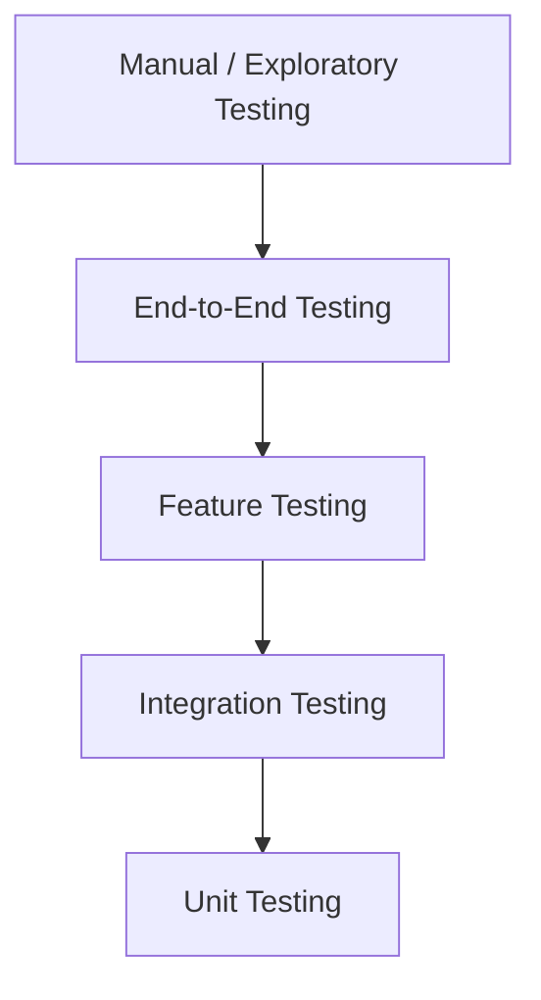

# 09. Testing Standards
## INAKARA CRM — Permanent Testing Standards

**Status:** Binding — Subordinate to `PROJECT_CONSTITUTION.md`, `01-product-rules.md`, `02-design-principles.md`, `03-design-system.md`, `frontend-architecture.md`, `backend-architecture.md`, `06-database-rules.md`, `07-api-standards.md`, `08-security-rules.md`
**Version:** 1.0.0
**Stack:** Laravel 13, PHP 8.3+, PestPHP, React 19, Inertia.js, MySQL, Spatie Permission, Laravel Excel, DomPDF
**Scope:** This document defines testing standards only. It contains no test code, no test files, no test cases, and no Pest or PHPUnit syntax. Every future module must comply with this document.

---

## Table of Contents

1. [Testing Philosophy](#1-testing-philosophy)
2. [Testing Pyramid](#2-testing-pyramid)
3. [Testing Strategy](#3-testing-strategy)
4. [Unit Testing Standards](#4-unit-testing-standards)
5. [Feature Testing Standards](#5-feature-testing-standards)
6. [Integration Testing Standards](#6-integration-testing-standards)
7. [Database Testing](#7-database-testing)
8. [Authentication Testing](#8-authentication-testing)
9. [Authorization Testing](#9-authorization-testing)
10. [Validation Testing](#10-validation-testing)
11. [API Testing](#11-api-testing)
12. [UI Testing Philosophy](#12-ui-testing-philosophy)
13. [Performance Testing](#13-performance-testing)
14. [Security Testing](#14-security-testing)
15. [Regression Testing](#15-regression-testing)
16. [Test Data Standards](#16-test-data-standards)
17. [Test Environment](#17-test-environment)
18. [Naming Convention](#18-naming-convention)
19. [Coverage Goals](#19-coverage-goals)
20. [CI/CD Testing Strategy](#20-cicd-testing-strategy)
21. [Bug Management](#21-bug-management)
22. [Quality Gates](#22-quality-gates)
23. [Anti-Patterns](#23-anti-patterns)
24. [Best Practices](#24-best-practices)
25. [Testing Decision Guide](#25-testing-decision-guide)
26. [Glossary](#26-glossary)
27. [References](#27-references)

---

## 1. Testing Philosophy

**Why testing is important.** INAKARA CRM enforces over a hundred business rules (`01-product-rules.md` Section 4) governing money, commitments, and customer relationships. A defect in this logic is not cosmetic — it can misprice a quotation, double-invoice a customer, or silently corrupt a Sales Order's history. Testing is the mechanism that lets the team change and grow the system with confidence that these rules still hold.

**Shift Left Testing.** Defects are addressed as early as possible — at the point of writing a Service method, not after a feature ships. Validating behavior early is cheaper, faster, and less disruptive than discovering the same defect in production.

**Confidence over Coverage.** A coverage percentage is a proxy metric, not the goal itself. The actual goal is confidence that critical business rules behave correctly; a smaller set of well-designed tests covering real business scenarios is worth more than a large set of tests asserting trivial getters and setters.

**Fast Feedback.** Tests are structured (per the pyramid in Section 2) so that the majority run in seconds, giving developers — human or AI — near-immediate confirmation that a change is safe, rather than waiting on slow, infrequent test cycles.

**Reliable Software.** Enterprise customers depend on INAKARA CRM to run their revenue process daily; reliability is not a bonus feature, it is the product's core promise, and testing is the primary mechanism protecting that promise.

**Regression Prevention.** Every fixed bug represents a scenario the system previously handled incorrectly; testing standards ensure that scenario is captured permanently, so the same defect cannot silently reappear as the codebase evolves.

**Quality First.** Testing is treated as an integral part of building a feature, not an optional final step — a feature is not considered complete until it is adequately tested per this document.

---

## 2. Testing Pyramid

*(Read from bottom to top: Unit tests form the largest base; Manual testing is the smallest, most targeted top layer.)*

| Layer | Purpose |
|---|---|
| **Unit Test** | Verifies a single class or method's logic in isolation (e.g., a Service method's calculation or a Zod schema's validation rule) — fast, numerous, and the primary safety net for business logic correctness. |
| **Integration Test** | Verifies that multiple components (e.g., Service and Repository, or two Services collaborating across a business process) work correctly together, per Section 6. |
| **Feature Test** | Verifies a full request-to-response flow through a Controller, including validation, authorization, and Service orchestration, from an HTTP-request perspective (per Section 5). |
| **End-to-End Test** | Verifies a complete user journey through the actual rendered application (e.g., creating a Lead through to issuing an Invoice), used sparingly for the most critical, cross-cutting business flows. |
| **Manual Testing** | Reserved for exploratory testing, usability judgment, and scenarios genuinely impractical to automate (e.g., final visual review against `02-design-principles.md`), applied narrowly and deliberately. |

**Pyramid Principle:** The number of tests decreases moving up the pyramid, and the cost/slowness of each test increases. This shape is deliberate — automated coverage should be concentrated where it is fastest and most precise (Unit), with fewer, more expensive tests reserved for verifying that the pieces work together correctly (Feature, Integration, End-to-End).

---

## 3. Testing Strategy

| Concern | Strategy |
|---|---|
| **Business Logic** | Tested primarily at the Unit level, directly against Service methods, verifying every business rule in `01-product-rules.md` that the Service enforces. |
| **Database** | Tested through Feature and Integration tests exercising real database interactions (Section 7), verifying data integrity rules from `06-database-rules.md` actually hold. |
| **Authentication** | Tested at the Feature level (Section 8), verifying the full login/session flow behaves per `08-security-rules.md` Section 2. |
| **Authorization** | Tested at both Unit level (Policy logic in isolation) and Feature level (an unauthorized request is correctly rejected end-to-end), per Section 9. |
| **Validation** | Tested at the Feature level against Form Requests, verifying every validation rule in `backend-architecture.md` Section 8 is actually enforced, per Section 10. |
| **Permissions** | Tested at the Feature level, verifying role-based access behaves per `01-product-rules.md` Section 8 and `08-security-rules.md` Section 3. |
| **Reports** | Tested at the Feature/Integration level, verifying report output matches expected aggregation logic and remains reproducible for historical periods (`01-product-rules.md` Rule 93). |
| **Exports** | Tested at the Feature level, verifying exported data respects the same access rules as the live system (`01-product-rules.md` Rule 97). |
| **Imports** | Tested at the Feature/Integration level, verifying validation, duplicate detection, and rollback behavior per `06-database-rules.md` Section 18. |
| **Notifications** | Tested at the Unit/Integration level, verifying the correct Notification is dispatched for the correct Event, per `backend-architecture.md` Section 13/15, using fakes rather than sending real notifications. |
| **Jobs** | Tested at the Unit/Integration level, verifying queued Job logic executes correctly, using fakes rather than a real queue connection. |
| **Events** | Tested at the Integration level, verifying the correct Listener chain fires for a given Event, per `backend-architecture.md` Section 13. |
| **Policies** | Tested at the Unit level in isolation, verifying every allow/deny branch of each Policy's logic. |
| **Queues** | Tested at the Integration level, verifying jobs are correctly dispatched to the queue (using Laravel's queue faking), not necessarily requiring a live queue worker in the test suite. |

---

## 4. Unit Testing Standards

- **Scope:** A single class or method's logic, tested in isolation from its collaborators (database, external services, other Services).
- **Naming:** Test names describe the business scenario and expected outcome in plain language (e.g., "it disqualifies a lead when a reason is provided"), never the internal method name alone.
- **Isolation:** Dependencies are faked or mocked so the test verifies only the unit's own logic, not the correctness of its collaborators (which are tested independently, in their own unit tests).
- **Mocking Philosophy:** Mocking is used to isolate the unit under test from genuinely external or slow concerns (database, HTTP calls, file system); mocking is not used to avoid testing real, fast, in-process logic that could reasonably be tested directly.
- **Assertions:** Each test asserts on business-meaningful outcomes (a returned value, a resulting state, a thrown exception) rather than internal implementation detail that could change without the actual behavior changing.
- **Coverage Expectations:** Every Service method enforcing a business rule from `01-product-rules.md` has at least one corresponding unit test for its primary success path and its primary failure/exception path.
- **Best Practices:** One logical assertion focus per test; descriptive naming; no shared mutable state between tests (Section 23).

---

## 5. Feature Testing Standards

Feature tests exercise a full request-to-response cycle, verifying:

- **HTTP Requests:** The correct status code and response shape are returned for a given request, per `07-api-standards.md` Section 6.
- **CRUD:** Create, Read, Update, and Delete (soft delete) operations behave correctly end-to-end, including their effect on the database.
- **Authentication:** Protected routes correctly reject unauthenticated requests and accept authenticated ones.
- **Authorization:** Protected actions correctly reject unauthorized users and accept authorized ones, per Section 9.
- **Validation:** Invalid requests are correctly rejected with the expected validation error structure, per Section 10.
- **Session:** Session state (e.g., authentication persistence across requests) behaves as expected.
- **Response:** Response content matches the expected structure and data, per `07-api-standards.md` Section 6.
- **Redirect:** Redirect behavior (e.g., after a successful Inertia form submission) matches expected navigation flow.
- **Flash Messages:** Success/error flash messages (surfaced as Toast notifications per `frontend-architecture.md` Section 15) are correctly set for the relevant outcome.
- **Error Handling:** Business, validation, and system errors are surfaced with the correct status code and message structure, per `backend-architecture.md` Section 16.

---

## 6. Integration Testing Standards

Integration tests verify that distinct modules correctly collaborate across a business process, particularly at the seams called out in `01-product-rules.md` Section 4:

| Integration Path | What Is Verified |
|---|---|
| **Sales → Invoice** | A confirmed Sales Order correctly produces a valid Invoice, respecting the amount and line-item rules in `01-product-rules.md` Section 4.8. |
| **Quotation → Order** | An approved Quotation correctly converts into a Sales Order with matching, locked terms, per `01-product-rules.md` Rule 35–36. |
| **Inventory → Delivery** | A Delivery correctly reflects and updates stock movement, per `06-database-rules.md` Section 14 (Inventory ledger). |
| **Payment → Finance** | A recorded Payment correctly updates Invoice balance and downstream Deal completion eligibility, per `01-product-rules.md` Rule 63 and Rule 89. |

**Rule:** Integration tests focus specifically on the correctness of the *handoff* between modules — data consistency, correct triggering of downstream Events (`backend-architecture.md` Section 13), and correct enforcement of cross-module business rules — not on re-verifying logic already covered by each module's own unit tests.

---

## 7. Database Testing

- **Migration:** Migrations are verified to run cleanly (up and down where applicable) as part of the automated test suite's setup, catching schema errors before they reach any environment.
- **Factories:** Every core model has a corresponding factory producing valid, realistic test data, used consistently across Unit, Feature, and Integration tests (Section 16).
- **Seeders:** Used to establish baseline reference/master data (per `06-database-rules.md` Section 13) required for realistic test scenarios (e.g., default roles, statuses).
- **Transactions:** Each test runs within a database transaction that is rolled back at the end of the test, ensuring no test's data persists to affect another.
- **Rollback:** Verified explicitly for any migration or data operation where rollback correctness is business-relevant (e.g., a failed import batch, per `06-database-rules.md` Section 18).
- **Database Refresh:** The test database schema is kept in sync with the current migration state automatically as part of the test suite's execution, never manually maintained.
- **Data Isolation:** No test's setup or assertions depend on data created by another test; each test is fully self-contained (Section 23).

---

## 8. Authentication Testing

- **Login:** Verified for both successful authentication with valid credentials and correct rejection of invalid credentials, per `08-security-rules.md` Section 2.
- **Logout:** Verified to fully invalidate the session, per `08-security-rules.md` Section 5.
- **Password Reset:** Verified for the full flow — request, token validation, successful reset, and correct rejection of expired/invalid tokens.
- **Email Verification:** Verified for both the verification flow itself and the restriction of sensitive actions to verified accounts, per `08-security-rules.md` Section 4.
- **Session:** Verified for expected session lifetime, idle timeout, and regeneration behavior, per `08-security-rules.md` Section 5.
- **Remember Me:** Verified for correct persistence behavior and independent revocability from the standard session.
- **Inactive Accounts:** Verified for correct handling of login attempts against inactive or locked accounts, per `08-security-rules.md` Section 4.

---

## 9. Authorization Testing

- **RBAC:** Every role's expected access is verified against representative protected actions, confirming the role behaves per `01-product-rules.md` Section 8 and `backend-architecture.md` Section 10.
- **Policies:** Every Policy's allow and deny branches are tested directly, per Section 3.
- **Permissions:** Fine-grained permission checks are verified independently of role-level checks, confirming permission-based access works as designed, per `08-security-rules.md` Section 3.
- **Ownership:** Record ownership rules (e.g., a Sales representative accessing only their own Leads) are verified explicitly, per `01-product-rules.md` Rule 9 and `08-security-rules.md` Section 3.
- **Branch Access:** Branch-scoped isolation is verified to correctly restrict cross-branch data access, per `06-database-rules.md` Section 15.
- **Company Access:** Company-scoped isolation is verified similarly, at the outermost isolation boundary.
- **Warehouse Access:** Warehouse-scoped isolation is verified for Inventory/Delivery-related access.
- **Menu Visibility:** Verified that navigation reflects the resolved permission set correctly, per `frontend-architecture.md` Section 11 — tested at the level of the data driving menu visibility, not pixel-level UI rendering.
- **Button Visibility:** Verified similarly for action-level visibility, confirming the underlying permission data is correctly resolved and exposed.

---

## 10. Validation Testing

- **Required Fields:** Every required field's absence is verified to produce the expected validation error.
- **Invalid Values:** Type mismatches, out-of-range values, and malformed input are verified to be correctly rejected.
- **Duplicate Data:** Uniqueness rules (e.g., unique Invoice numbers, per `01-product-rules.md` Rule 56) are verified to be enforced.
- **Business Rules:** Business-level validation (e.g., a Quotation cannot be approved if expired, per `01-product-rules.md` Rule 23) is verified at the Service/Feature level, distinct from structural Form Request validation.
- **Boundary Values:** Edge cases (zero, negative where disallowed, maximum length/size limits) are explicitly tested, not only "typical" valid input.
- **Date Validation:** Date range logic, expiry calculations, and timezone-consistent handling (per `01-product-rules.md` Global Rules) are explicitly verified.
- **File Validation:** Upload type, size, and format restrictions (per `08-security-rules.md` Section 10) are verified to correctly accept valid files and reject invalid ones.

---

## 11. API Testing

Applied to every endpoint per `07-api-standards.md`:

- **Status Codes:** Every endpoint's success and failure paths return the correct, expected HTTP status code.
- **Response Structure:** Every response matches the unified envelope defined in `07-api-standards.md` Section 6.
- **Pagination:** Paginated endpoints are verified for correct page boundaries, metadata accuracy, and stable ordering.
- **Filtering:** Every supported filter is verified to correctly narrow results, per `07-api-standards.md` Section 9.
- **Sorting:** Every supported sort field and direction is verified, per `07-api-standards.md` Section 10.
- **Search:** Search endpoints are verified for correct matching behavior, per `07-api-standards.md` Section 11.
- **Authentication:** Verified per Section 8, applied specifically to API/Controller-level endpoints.
- **Authorization:** Verified per Section 9, applied specifically to API/Controller-level endpoints.
- **Rate Limiting:** Verified that defined limits (per `08-security-rules.md` Section 21) are actually enforced once exceeded.
- **Error Responses:** Every documented error scenario (validation, business, authorization, not found, server error) is verified to produce the correct, consistent structure per `07-api-standards.md` Section 6.

---

## 12. UI Testing Philosophy

Frontend testing focuses on behavior and correctness that materially affects the user's ability to complete business work, evaluated against `frontend-architecture.md` and `02-design-principles.md`, without prescribing specific implementation:

- **Forms:** Verified for correct validation feedback, submission behavior, and error/success state handling (per `frontend-architecture.md` Section 8).
- **Navigation:** Verified for correct routing behavior and permission-driven visibility (per Section 9).
- **Dashboard:** Verified for correct data rendering per role (per `01-product-rules.md` Section 12) — not for pixel-perfect visual layout, which is a design review concern (Section 2, Manual Testing).
- **Responsive Behavior:** Verified for correct adaptation at defined breakpoints (per `03-design-system.md` Section 17), focused on functional usability at each size rather than exhaustive visual comparison.
- **Loading:** Verified that loading states (Skeleton, per `frontend-architecture.md` Section 14) appear and resolve correctly around asynchronous operations.
- **Empty States:** Verified that empty-state messaging and actions appear correctly when no data is present.
- **Accessibility:** Verified for keyboard operability and correct semantic structure of key interactive components, per `03-design-system.md` Section 18.

**Philosophy:** Frontend tests verify *behavior* — what the user can do and what they see as a result — never internal component implementation detail that could change without the actual user-facing behavior changing (Section 23).

---

## 13. Performance Testing

| Concern | What Is Verified |
|---|---|
| **Large Dataset** | The system remains responsive and correct when operating against realistically large data volumes, not only small development-scale datasets. |
| **Pagination** | Pagination performance remains stable and does not degrade unacceptably as the underlying dataset grows, per `06-database-rules.md` Section 16. |
| **Search** | Search performance remains acceptable against realistic data volume, verifying the indexing strategy in `06-database-rules.md` Section 8 is effective. |
| **Filtering** | Filtered queries remain performant at scale, per the same indexing strategy. |
| **Export** | Large exports complete successfully via the queued mechanism (`backend-architecture.md` Section 14) without timing out or exhausting memory. |
| **Import** | Large imports are verified for correct, performant batch processing (`06-database-rules.md` Section 16). |
| **Queue** | Queue throughput and job completion are verified under realistic job volume. |
| **Report Generation** | Report generation completes within an acceptable time frame against realistic historical data volume, per `01-product-rules.md` Section 13. |

Performance testing is conducted deliberately, against realistic data volumes representative of actual enterprise usage, not assumed safe based on development-environment performance alone.

---

## 14. Security Testing

Applied consistently with `08-security-rules.md`:

- **Authentication:** Verified that authentication cannot be bypassed through any tested endpoint (Section 8).
- **Authorization:** Verified that authorization cannot be bypassed, including through direct/crafted requests that skip expected UI navigation (Section 9).
- **CSRF:** Verified that state-changing requests without a valid CSRF token are correctly rejected, per `08-security-rules.md` Section 6.
- **XSS:** Verified that user-supplied content is correctly escaped/sanitized on output, per `08-security-rules.md` Section 7.
- **SQL Injection:** Verified that malicious input patterns are safely handled without altering query behavior, per `08-security-rules.md` Section 8.
- **Mass Assignment:** Verified that models correctly reject assignment of non-fillable fields, per `backend-architecture.md` Section 29.
- **Sensitive Data Exposure:** Verified that API responses never include fields a given role is not entitled to see, per `08-security-rules.md` Section 11 and Section 15.
- **Session Security:** Verified for correct timeout, regeneration, and invalidation behavior, per `08-security-rules.md` Section 5.

---

## 15. Regression Testing

- **Mandatory Before Release:** The full automated test suite is run and must pass before any release candidate is approved, per Section 22 (Quality Gates).
- **Mandatory After Major Refactoring:** Any significant internal restructuring (e.g., a Service or Repository refactor) is followed by a full regression run, confirming existing behavior is unchanged even though implementation has changed.
- **Mandatory After Infrastructure Changes:** Changes to the underlying platform (PHP version, Laravel version, database version, queue infrastructure) are followed by a full regression run before being adopted in production, since such changes can affect behavior in ways unit tests alone may not fully surface.
- **Bug-Driven Regression:** Every confirmed bug fix (Section 21) is accompanied by a new or updated test that would have caught the original defect, ensuring the specific scenario can never silently regress.

---

## 16. Test Data Standards

- **Factories:** The default, preferred mechanism for generating test data, producing realistic, valid records for every core model, per Section 7.
- **Seeders:** Used for baseline reference/master data required across many tests (roles, statuses, default settings), kept minimal and stable.
- **Dummy Data:** Generated data reflects realistic business scenarios (plausible names, amounts, dates) rather than meaningless placeholder values, improving the readability and business relevance of test scenarios.
- **Consistency:** The same factory/seeder patterns are used consistently across every module's test suite, per `frontend-architecture.md`/`backend-architecture.md` naming and structure conventions.
- **Isolation:** No test's data setup depends on another test having run first or on data left over in the database (Section 7).
- **Repeatability:** Running the same test suite multiple times, in any order, on a fresh database, always produces the same result — no test depends on wall-clock time, external state, or execution order.

---

## 17. Test Environment

| Environment | Purpose |
|---|---|
| **Local** | Individual developer machine (or AI-driven development session), running the fastest possible feedback loop (Unit and Feature tests) during active development. |
| **Development** | A shared, integrated environment where merged changes are validated together before promotion. |
| **Staging** | A production-like environment used for final validation, including realistic data volume (Section 13) and full regression testing (Section 15), before release. |
| **Production** | Never used for test execution; production is validated through monitoring (`08-security-rules.md` Section 17) and controlled release practices (Section 20), never by running test suites against live business data. |

**Environment Separation:** Test execution never touches production data or production infrastructure under any circumstance; each environment has its own isolated database and configuration, consistent with `06-database-rules.md` Section 19 (Backup & Recovery) integrity.

---

## 18. Naming Convention

| Element | Convention | Example |
|---|---|---|
| **Test Files** | Mirror the class or feature under test, suffixed appropriately by test type | `LeadServiceTest`, `CreateLeadFeatureTest` |
| **Test Classes/Groups** | Organized by module, mirroring the business module structure in `backend-architecture.md` Section 11 | Grouped under a `Lead`, `Quotation`, `Invoice` namespace/folder |
| **Test Methods/Scenarios** | Named as plain-language business scenarios describing behavior and expected outcome, not internal method names | "it prevents invoicing a cancelled sales order" |
| **Scenario Naming** | Consistently follows a "it [does expected behavior] when [condition]" or equivalent readable pattern across the entire suite | — |
| **Folder Organization** | Mirrors the module structure of `backend-architecture.md` Section 2 and `frontend-architecture.md` Section 2, so a test for a given module is always found in the corresponding, predictable location | `tests/Feature/Lead/`, `tests/Unit/Lead/` |

This convention is applied uniformly; no module defines its own alternate naming pattern.

---

## 19. Coverage Goals

| Area | Coverage Priority |
|---|---|
| **Business Logic (Services)** | Highest priority — every business rule in `01-product-rules.md` enforced by a Service has corresponding test coverage for its success and failure paths. |
| **Repositories** | Covered where query logic is complex enough to carry genuine risk of incorrect results (e.g., reporting aggregations), rather than trivial pass-through queries. |
| **Controllers** | Covered at the Feature level (Section 5), verifying the full request/response contract rather than duplicating Service-level Unit test detail. |
| **Policies** | Full coverage of every allow/deny branch, given their direct security role (Section 9). |
| **API** | Full coverage of documented request/response contracts per `07-api-standards.md`. |
| **Critical Modules** | Lead, Quotation, Sales Order, Invoice, and Payment (the core sales-to-cash chain, per `01-product-rules.md` Section 3) hold the highest coverage priority of all, since defects here have the most direct financial and trust impact. |

**Realistic Enterprise Expectation:** A specific numeric coverage percentage target is set and tracked at the project management level, but is never treated as more important than actual confidence in critical-path correctness — 100% coverage of trivial code is not a substitute for thorough coverage of the business rules in `01-product-rules.md` Section 4.

---

## 20. CI/CD Testing Strategy

| Stage | Testing Requirement |
|---|---|
| **Before Commit** | Fast, local tests (Unit, relevant Feature tests) are run to catch obvious regressions before code is even shared. |
| **Before Pull Request** | The full automated suite relevant to the changed module(s) is run, confirming the change is ready for review. |
| **Before Merge** | The full test suite runs automatically against the proposed merge, blocking merge on any failure — no change enters the shared codebase with a broken test suite. |
| **Before Release** | Full regression (Section 15), including Integration and End-to-End tests for critical flows, is run against a staging environment with realistic data. |
| **Before Production Deployment** | Final quality gate checks (Section 22) are confirmed satisfied immediately prior to deployment. |

**Continuous Integration Philosophy:** Testing is automated and enforced at every stage of the pipeline, not left to individual discipline alone — a broken test is a blocking event, not a warning to be addressed "later."

---

## 21. Bug Management

- **Bug Severity:** Classified by business impact (e.g., data corruption or financial miscalculation is more severe than a cosmetic UI inconsistency), guiding response urgency.
- **Bug Priority:** Classified by how soon the bug must be addressed relative to release timelines and business impact, distinct from severity (a low-severity bug can still be high-priority if it affects a release deadline).
- **Reproduction Steps:** Every reported bug includes clear, minimal steps to reproduce it before being accepted into the fix queue, ensuring the fix can be verified against the actual reported scenario.
- **Verification:** Every bug fix is verified against its original reproduction steps before being considered resolved.
- **Regression Verification:** Every bug fix includes a corresponding automated test (Section 15) confirming the specific defect cannot silently reappear.

---

## 22. Quality Gates

A release candidate must satisfy all of the following before promotion to production:

- **No Critical Bugs:** No open bug classified at the highest severity level (Section 21) affecting core business flows.
- **Tests Passing:** The full automated test suite passes without exception.
- **Coverage Target Met:** The defined coverage target (Section 19) is met, with particular attention to the Critical Modules list.
- **Security Validation Completed:** Security testing (Section 14) has been performed against the release candidate, with no unresolved high-severity findings.
- **Performance Acceptable:** Performance testing (Section 13) confirms acceptable behavior at realistic data volume for any changed or new functionality.

**Rule:** A release does not proceed if any quality gate is unmet; gates are not waived for schedule pressure without an explicit, documented, and accountable exception decision at the appropriate management level.

---

## 23. Anti-Patterns

- **Skipping tests for critical features.** Directly undermines the confidence guarantee this document exists to provide, precisely where the cost of a defect is highest.
- **Testing implementation instead of behavior.** Tests that assert on internal method calls or private state rather than observable outcomes break every time the implementation is refactored, even when behavior is unchanged — creating maintenance burden without corresponding safety benefit.
- **Shared mutable test data.** Tests that read or write shared, non-isolated data create unpredictable, order-dependent failures that are difficult to diagnose and erode trust in the test suite itself.
- **Random test order dependency.** A test suite that only passes in a specific execution order hides bugs and makes parallelization or reordering (common in CI systems) unreliable.
- **Ignoring failed tests.** Treating a failing test as "known flaky" or "not important" without investigation defeats the entire purpose of automated testing and normalizes an unreliable suite.
- **Hardcoded test values.** Brittle, arbitrary hardcoded values (e.g., an assumed record ID) break unpredictably as data setup changes and obscure the actual scenario being tested.
- **Testing production database.** Running tests against real production data risks corrupting or exposing genuine business/customer data and violates the environment separation in Section 17.
- **Ignoring edge cases.** Testing only the "happy path" leaves boundary conditions, error handling, and business rule exceptions (`01-product-rules.md` Section 4) unverified, precisely where defects are most likely to hide.

---

## 24. Best Practices

- Test behavior, not implementation — assert on outcomes a real user or consumer would observe.
- Keep tests independent — no test relies on another test's side effects.
- Keep tests readable — a test's intent should be clear from its name and structure alone.
- Test critical business logic first — prioritize the sales-to-cash chain (Section 19) before peripheral features.
- Automate repetitive testing — anything verified manually more than once is a candidate for automation.
- Maintain deterministic tests — no reliance on real time, random values, or external network calls without explicit control.
- Prefer factories over manual setup — consistent, realistic data generation over ad hoc, inconsistent fixtures.
- Write meaningful assertions — assert on the specific business outcome the scenario is meant to verify, not a superficial proxy for it.

---

## 25. Testing Decision Guide

When a future developer (human or AI) builds a new feature or module, the following sequence is the permanent, authoritative testing decision path:

1. **Unit Tests — Always Required When:** New or changed business logic exists in a Service, Policy, or any class encapsulating a business rule from `01-product-rules.md`. Unit tests are the default, first line of coverage for any new logic.
2. **Feature Tests — Always Required When:** A new or changed Controller endpoint is introduced, verifying the full authenticated, authorized, validated request/response contract per Section 5.
3. **Integration Tests — Required When:** A feature spans a cross-module handoff identified in Section 6 (or an equivalent new handoff introduced by a future module), verifying the seam itself, not just each side independently.
4. **Every New Module Must Test:** Its core business rules (Unit), its primary Controller endpoints (Feature), any cross-module handoff it introduces (Integration), and its authorization rules (Section 9) — this is the non-negotiable minimum for any new module, per Section 19's Critical Modules philosophy extended to all future modules.
5. **What Can Be Manually Tested:** Final visual/design review against `02-design-principles.md` and `03-design-system.md`, genuinely exploratory usability evaluation, and one-off, low-risk configuration changes with no business logic impact.
6. **What Must Never Skip Testing:** Any logic affecting money (pricing, discounts, invoicing, payment), any logic affecting data integrity across the sales-to-cash chain (Section 19's Critical Modules), any authentication or authorization logic (`08-security-rules.md`), and any previously-fixed bug's regression coverage (Section 21) — these are never considered optional, regardless of schedule pressure.

This sequence is the permanent, authoritative testing decision path for all future development on INAKARA CRM.

---

## 26. Glossary

| Term | Definition |
|---|---|
| **Unit Test** | A test verifying a single class or method's logic in isolation from its collaborators. |
| **Feature Test** | A test verifying a full HTTP request-to-response flow through a Controller. |
| **Integration Test** | A test verifying correct collaboration between multiple modules or components. |
| **Regression** | The reappearance of a previously fixed defect. |
| **Quality Gate** | A defined, mandatory condition that must be satisfied before a release proceeds. |
| **Test Isolation** | The property that a test's setup, execution, and assertions do not depend on or affect any other test. |

## 27. References

- `PROJECT_CONSTITUTION.md` — supreme authority; Section 5 (Engineering Philosophy) establishes documentation- and quality-first discipline this document operationalizes for testing.
- `01-product-rules.md` — the business rules this testing standard exists to protect.
- `backend-architecture.md` — Section 27 (Testing Strategy) this document expands in full detail.
- `07-api-standards.md` — the API contract this document's API Testing standards (Section 11) verify.
- `08-security-rules.md` — the security standards this document's Security Testing standards (Section 14) verify.

---

*End of 09-testing-standards.md — Version 1.0.0*
