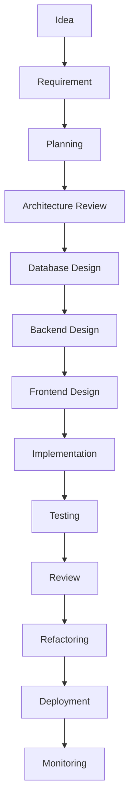

# 10. Development Workflow
## INAKARA CRM — Permanent Development Workflow

**Status:** Binding — Subordinate to `PROJECT_CONSTITUTION.md`, `01-product-rules.md`, `02-design-principles.md`, `03-design-system.md`, `frontend-architecture.md`, `backend-architecture.md`, `06-database-rules.md`, `07-api-standards.md`, `08-security-rules.md`, `09-testing-standards.md`
**Version:** 1.0.0
**Scope:** This document defines how the project is developed — process, workflow, and decision discipline only. It contains no code, no feature implementation, and no project planning artifacts (timelines, tickets). Every future feature, module, page, API, database change, and UI update must follow this workflow.

---

## Table of Contents

1. [Development Philosophy](#1-development-philosophy)
2. [Development Lifecycle](#2-development-lifecycle)
3. [Feature Development Workflow](#3-feature-development-workflow)
4. [Module Development Workflow](#4-module-development-workflow)
5. [Task Breakdown](#5-task-breakdown)
6. [Git Workflow](#6-git-workflow)
7. [Code Review Workflow](#7-code-review-workflow)
8. [Database Change Workflow](#8-database-change-workflow)
9. [Backend Development Workflow](#9-backend-development-workflow)
10. [Frontend Development Workflow](#10-frontend-development-workflow)
11. [API Development Workflow](#11-api-development-workflow)
12. [UI Development Workflow](#12-ui-development-workflow)
13. [Testing Workflow](#13-testing-workflow)
14. [Bug Fix Workflow](#14-bug-fix-workflow)
15. [Refactoring Workflow](#15-refactoring-workflow)
16. [Release Workflow](#16-release-workflow)
17. [Documentation Workflow](#17-documentation-workflow)
18. [AI Collaboration Workflow](#18-ai-collaboration-workflow)
19. [Decision-Making Rules](#19-decision-making-rules)
20. [Definition of Done (DoD)](#20-definition-of-done-dod)
21. [Anti-Patterns](#21-anti-patterns)
22. [Best Practices](#22-best-practices)
23. [Developer Checklist](#23-developer-checklist)
24. [Future Scalability](#24-future-scalability)
25. [Permanent Development Decision Guide](#25-permanent-development-decision-guide)
26. [Glossary](#26-glossary)
27. [References](#27-references)

---

## 1. Development Philosophy

- **Build Slowly.** INAKARA CRM is built to run for years, not to ship a single release quickly and be abandoned. Deliberate pacing that respects architecture and documentation is a feature of this project, not a delay to be minimized.
- **Build Correctly.** A feature that works but violates the Constitution, the Product Rules, or the Design System is not considered done — correctness is measured against the full foundation, not just functional behavior.
- **Consistency over Speed.** A faster but inconsistent implementation creates compounding cost for every future feature that has to work around it; consistency is prioritized even when it costs more time up front.
- **Quality over Quantity.** Fewer, well-built features are preferred over many features built to a lower standard — quality debt compounds faster than feature backlog.
- **Documentation First.** Per `PROJECT_CONSTITUTION.md` Section 8, no significant feature begins implementation without the relevant documentation existing or being extended first.
- **Architecture First.** Structure is decided before code is written, per `PROJECT_CONSTITUTION.md` Section 6 — this workflow exists specifically to enforce that discipline in practice.
- **Test Before Release.** No feature reaches production without satisfying `09-testing-standards.md`, applied without exception.
- **Scalable Development.** The workflow itself must scale from a single developer (or AI-assisted session) to a large team without changing its fundamental shape, per Section 24.
- **Long-Term Maintainability.** Every workflow decision in this document optimizes for the project's third year of life, not its third week.

---

## 2. Development Lifecycle

| Phase | Purpose |
|---|---|
| **Idea** | A business or product need is identified, evaluated against `01-product-rules.md` for alignment with existing business rules. |
| **Requirement** | The idea is translated into a clear, specific business requirement, including which existing rules it extends or which new rules it introduces. |
| **Planning** | The requirement is scoped and sequenced (Section 5), with dependencies on existing modules identified. |
| **Architecture Review** | The proposed approach is checked against `frontend-architecture.md`, `backend-architecture.md`, and `PROJECT_CONSTITUTION.md` before any code is written, per Section 7. |
| **Database Design** | Any required schema change is designed per `06-database-rules.md`, including the Decision Guidelines in that document's Section 23. |
| **Backend Design** | The Service/Repository/Controller shape of the feature is planned per `backend-architecture.md`, before implementation begins. |
| **Frontend Design** | The page/module/component shape is planned per `frontend-architecture.md` and `03-design-system.md`, before implementation begins. |
| **Implementation** | Code is written following Sections 9–12 of this document. |
| **Testing** | The feature is tested per `09-testing-standards.md`, at every relevant pyramid layer. |
| **Review** | Code review is performed per Section 7, validating architecture, security, and quality. |
| **Refactoring** | Any improvement identified during review or testing is applied per Section 15, before release, not deferred indefinitely. |
| **Deployment** | The feature is released per Section 16. |
| **Monitoring** | The feature's real-world behavior is observed post-release, per `backend-architecture.md` Section 18 and `08-security-rules.md` Section 17, closing the loop back to future Ideas. |

**Rule:** No phase is skipped; a phase may be brief for a small change, but it is never entirely bypassed for any feature that touches business logic, schema, or user-facing behavior.

---

## 3. Feature Development Workflow

Every new feature, regardless of size, follows this sequence:

1. **Requirements** — the business need is stated explicitly, referencing the relevant section of `01-product-rules.md` it implements or extends.
2. **Analysis** — the feature's impact on existing modules, data, and permissions is assessed before design begins.
3. **Database** — any schema change is designed per `06-database-rules.md`.
4. **Backend** — Service, Repository, Controller, Policy, and related classes are planned and implemented per `backend-architecture.md`.
5. **Frontend** — Pages, components, and hooks are planned and implemented per `frontend-architecture.md` and `03-design-system.md`.
6. **Testing** — the feature is tested per `09-testing-standards.md` at the appropriate pyramid layers.
7. **Documentation** — affected documentation is updated per Section 17, in the same development cycle, not deferred.
8. **Deployment** — the feature is released per Section 16.
9. **Post-Release Review** — the feature's real-world behavior is checked against its original requirement shortly after release, confirming it delivers the intended business outcome.

---

## 4. Module Development Workflow

A new business module (Lead, Customer, Quotation, Invoice, Production, Inventory, Analytics, Settings, or any future module) follows the identical workflow defined in Section 3, applied at module scope:

- The module's business rules are first fully specified in (or added to) `01-product-rules.md`.
- The module's data model is designed per `06-database-rules.md`, including its Company/Branch/Warehouse scoping per Section 15 of that document.
- The module's backend structure (Services, Repositories, Policies) is planned per `backend-architecture.md` Section 11.
- The module's frontend structure (`modules/{module}/`) is planned per `frontend-architecture.md` Section 3, following the exact same internal folder shape as every existing module.
- The module's API surface, if any, is planned per `07-api-standards.md`.
- The module's security posture is planned per `08-security-rules.md` Section 28 (Security Decision Guide).
- The module is tested per `09-testing-standards.md` Section 25 (Testing Decision Guide), satisfying the minimum testing requirement for any new module.

**Rule:** No new module invents its own structural pattern; every module is a fresh application of the same, already-established architecture, ensuring the platform's consistency scales with its module count rather than degrading.

---

## 5. Task Breakdown

Work is broken down using a consistent hierarchy:

| Level | Definition |
|---|---|
| **Epic** | A large, business-meaningful initiative spanning multiple features (e.g., "Sales Order Management"). |
| **Feature** | A discrete, shippable capability within an Epic (e.g., "Change Order support for confirmed Sales Orders"). |
| **Story** | A specific, user-facing behavior within a Feature, describable in terms of who needs it and why (e.g., "As a Sales Manager, I can approve a Change Order"). |
| **Task** | A concrete unit of implementation work fulfilling part of a Story (e.g., "Implement ChangeOrderService approval logic"). |
| **Subtask** | The smallest tracked unit of work, typically scoped to a single layer or concern (e.g., "Write unit tests for ChangeOrderService approval logic"). |

**Rule:** Every Task and Subtask traces upward to a Story, every Story to a Feature, and every Feature to an Epic — no work exists disconnected from a clear business justification rooted in `01-product-rules.md`.

---

## 6. Git Workflow

| Branch Type | Purpose | Naming Convention |
|---|---|---|
| **Feature Branch** | New feature development, per Section 3 | `feature/{module}-{short-description}` |
| **Bugfix Branch** | Non-urgent bug fixes, per Section 14 | `bugfix/{module}-{short-description}` |
| **Hotfix Branch** | Urgent, production-impacting fixes | `hotfix/{module}-{short-description}` |
| **Release Branch** | Stabilization of a set of features before release, per Section 16 | `release/{version}` |
| **Main Branch** | The always-deployable, production-reflecting branch | `main` |

- **Merge Strategy:** Feature and bugfix branches merge into a shared integration branch (or directly into `main` for smaller teams) only after passing Code Review (Section 7) and the full relevant test suite (`09-testing-standards.md` Section 20).
- **Commit Philosophy:** Commits are small, focused, and describe the business or technical change clearly — a commit represents one coherent unit of change, not an accumulation of unrelated edits, supporting Section 5's task-level traceability.

---

## 7. Code Review Workflow

- **When Review Is Required:** Every change merging into a shared branch requires review, without exception — no change, regardless of size or author (including AI-assisted changes), bypasses review.
- **Review Checklist:** Every review verifies the change against this document's Definition of Done (Section 20), not only whether the code "works."
- **Quality Standards:** Reviewed against `backend-architecture.md` Section 24 (Coding Standard) and `frontend-architecture.md` Section 22 (Coding Rules).
- **Architecture Validation:** Reviewed against `backend-architecture.md` and `frontend-architecture.md` structurally — does the change respect layer boundaries (Section 25 of `backend-architecture.md`), feature isolation (Section 23 of `frontend-architecture.md`), and existing naming conventions.
- **Security Validation:** Reviewed against `08-security-rules.md`, particularly Section 3 (Authorization), Section 9 (Input Validation), and Section 26 (Security Anti-Patterns).
- **Performance Validation:** Reviewed against `backend-architecture.md` Section 19 and `06-database-rules.md` Section 16, checking for obvious inefficiency (e.g., missing eager loading, missing indexes for new query patterns).

**Rule:** A review that only checks "does this run" without checking these dimensions is not considered a complete review.

---

## 8. Database Change Workflow

- **When Schema Changes:** Any new table, column, relationship, or index follows the Decision Guidelines in `06-database-rules.md` Section 23 before a migration is written.
- **Migration Strategy:** Every schema change is expressed as a versioned Laravel migration, applied through the controlled migration system per `06-database-rules.md` Section 19 — never as an ad hoc, manually-applied production change.
- **Rollback Strategy:** Every migration is designed with a working rollback path where feasible; where a migration is genuinely irreversible (e.g., a destructive data transformation), this is explicitly flagged and reviewed with extra scrutiny before being applied to production.
- **Data Migration:** Any migration that must transform or backfill existing data is tested against a realistic data copy before being applied to production, and is wrapped in a transaction per `06-database-rules.md` Section 12 where feasible.
- **Production Safety:** Schema changes are applied to production only after successful application to Staging (Section 17 of `09-testing-standards.md`) and after Code Review (Section 7) confirms the change follows every rule in `06-database-rules.md`.

---

## 9. Backend Development Workflow

For every backend change, the following sequence is followed, per `backend-architecture.md`:

1. **Controller** — defined last among backend components in terms of logic, first in terms of contract: its request/response shape is decided early to guide the Request and Service design.
2. **Request** — the Form Request validation rules are defined per `backend-architecture.md` Section 8.
3. **Service** — the business logic is implemented per `backend-architecture.md` Section 5, enforcing the relevant rules from `01-product-rules.md`.
4. **Repository** — any complex data access the Service requires is implemented per `backend-architecture.md` Section 6.
5. **Policy** — authorization rules are implemented per `backend-architecture.md` Section 9.
6. **Event** — any significant business occurrence is defined and dispatched per `backend-architecture.md` Section 13.
7. **Job** — any slow or external-dependent operation is implemented as a queued Job per `backend-architecture.md` Section 14.
8. **Notification** — any user-facing notification triggered by the change is implemented per `backend-architecture.md` Section 15.
9. **Testing** — Unit and Feature tests are written per `09-testing-standards.md` Section 4–5, covering the new Service, Policy, and Controller behavior.
10. **Documentation** — any new business rule, module, or API contract introduced is reflected in the relevant `.ai/` document per Section 17.

---

## 10. Frontend Development Workflow

For every frontend change, the following sequence is followed, per `frontend-architecture.md`:

1. **Page** — the page's structural template (list or detail, per `frontend-architecture.md` Section 7) is identified before any component work begins.
2. **Layout** — the correct Layout (`AppLayout`, `DashboardLayout`, `SettingsLayout`, etc., per `frontend-architecture.md` Section 5) is confirmed.
3. **Component** — new components are built following `03-design-system.md` Section 10, reusing shared components (`frontend-architecture.md` Section 4) wherever an equivalent already exists.
4. **Feature (Module)** — the component is placed within the correct feature module folder, per `frontend-architecture.md` Section 3.
5. **Hooks** — any reusable logic is extracted into a hook per `frontend-architecture.md` Section 22.
6. **Validation** — forms are validated per `frontend-architecture.md` Section 8 (React Hook Form + Zod).
7. **Responsive** — the component/page is verified against `03-design-system.md` Section 17 across breakpoints.
8. **Accessibility** — the component/page is verified against `03-design-system.md` Section 18.
9. **Testing** — behavior-focused tests are written per `09-testing-standards.md` Section 12.

---

## 11. API Development Workflow

For every new or changed API surface, per `07-api-standards.md`:

1. **Planning** — the endpoint is scoped per `07-api-standards.md` Section 27 (Decision Guide), identifying its consumer surface, naming, and method.
2. **Validation** — request validation is defined per `07-api-standards.md` Section 14.
3. **Authorization** — access rules are defined per `07-api-standards.md` Section 13.
4. **Response Standard** — the response shape follows `07-api-standards.md` Section 6 without deviation.
5. **Documentation** — the endpoint's contract is documented clearly enough for independent integration, per `07-api-standards.md` Section 27, Step 10.
6. **Testing** — API tests are written per `09-testing-standards.md` Section 11.
7. **Versioning** — any change to an existing, released endpoint's contract is evaluated against `07-api-standards.md` Section 19 before implementation, determining whether it is additive (safe) or breaking (requires a new version).

---

## 12. UI Development Workflow

Every UI change strictly follows the established visual foundation — designers and developers never design freely:

- **Design Principles:** Every screen is evaluated against `02-design-principles.md` before being considered complete.
- **Design System:** Every visual decision (color, spacing, radius, typography) draws exclusively from the tokens defined in `03-design-system.md` — no ad hoc value is introduced.
- **Accessibility:** Every interactive element satisfies `03-design-system.md` Section 18 before release.
- **Responsive:** Every screen satisfies `03-design-system.md` Section 17 across the defined breakpoints.
- **Performance:** Every screen follows `frontend-architecture.md` Section 18 (Performance Rules).
- **Consistency:** Every new screen is checked against existing, similar screens to confirm it follows the same structural pattern (`frontend-architecture.md` Section 7), rather than introducing a novel layout for a familiar page type.

**Rule:** "It looks fine to me" is never sufficient justification for a UI decision; every visual choice must be traceable to `02-design-principles.md` or `03-design-system.md`.

---

## 13. Testing Workflow

Testing is integrated into every phase of the lifecycle (Section 2), not appended at the end:

- **Unit Test:** Written alongside the Service/Policy logic it verifies, per `09-testing-standards.md` Section 4.
- **Feature Test:** Written alongside the Controller endpoint it verifies, per `09-testing-standards.md` Section 5.
- **Integration Test:** Written for any new cross-module handoff, per `09-testing-standards.md` Section 6.
- **Regression Test:** Added for every bug fix, per `09-testing-standards.md` Section 15 and Section 21.
- **Manual Verification:** Performed for final visual/design review and exploratory usability checks, per `09-testing-standards.md` Section 12.
- **Release Validation:** The full Quality Gate checklist (`09-testing-standards.md` Section 22) is confirmed before any release proceeds (Section 16).

---

## 14. Bug Fix Workflow

1. **Identify** — the bug is reported with enough context to be triaged, per `09-testing-standards.md` Section 21.
2. **Reproduce** — the bug is confirmed reproducible with clear steps before a fix is attempted.
3. **Analyze** — the root cause is identified, tracing whether it originates from a missed business rule (`01-product-rules.md`), an architectural violation, or an implementation defect.
4. **Fix** — the fix is implemented following the same layer discipline as any other change (Section 9/10), never as a quick patch that bypasses architecture.
5. **Test** — the fix is verified against the original reproduction steps.
6. **Regression Test** — a permanent automated test is added, per `09-testing-standards.md` Section 15, ensuring this exact defect cannot silently reappear.
7. **Deploy** — the fix is released per Section 16, using a Hotfix branch (Section 6) if the bug is production-urgent.
8. **Monitor** — the fix's effect is observed post-deployment to confirm full resolution.

---

## 15. Refactoring Workflow

- **When Refactoring Is Allowed:** Refactoring is a normal, expected activity (`PROJECT_CONSTITUTION.md` Section 12), performed whenever code no longer cleanly satisfies `backend-architecture.md` or `frontend-architecture.md` standards, or when a repeated pattern across modules should be extracted to a shared location (`frontend-architecture.md` Section 4, `backend-architecture.md` Section 5).
- **Avoiding Broken Features:** Refactoring never changes observable business behavior; if a refactor appears to require a behavior change, that is treated as a separate Feature (Section 3), not a refactor.
- **Testing Before Refactoring:** The code being refactored must have adequate test coverage (per `09-testing-standards.md` Section 19) before refactoring begins — refactoring without a safety net is not permitted for business-critical logic.
- **Testing After Refactoring:** The full relevant test suite is run after refactoring to confirm behavior is unchanged, per `09-testing-standards.md` Section 15.

---

## 16. Release Workflow

1. **Feature Freeze** — no new feature work is merged into the release scope once the release branch (Section 6) is cut; only stabilization fixes are permitted.
2. **Testing** — the full regression suite (`09-testing-standards.md` Section 15) is run against the release branch in Staging.
3. **Review** — a final review confirms the Quality Gates (`09-testing-standards.md` Section 22) are satisfied.
4. **Approval** — an accountable role (per `01-product-rules.md` Section 8, typically Owner or a designated release approver) explicitly approves the release.
5. **Deployment** — the release is deployed following a controlled, repeatable deployment procedure, never an ad hoc manual process for production.
6. **Monitoring** — the release is actively monitored immediately after deployment (`08-security-rules.md` Section 17), watching for errors, performance regressions, or unexpected behavior.
7. **Rollback Plan** — every release has a defined, tested rollback path, ready to be executed immediately if monitoring reveals a critical issue.

---

## 17. Documentation Workflow

Every feature update updates the relevant documentation in the same development cycle, never as a deferred follow-up:

- **PRD / Product Rules:** `01-product-rules.md` is updated whenever a new or changed business rule is introduced.
- **API Documentation:** Any new or changed endpoint's contract is documented per `07-api-standards.md` Section 27.
- **Architecture:** `frontend-architecture.md` or `backend-architecture.md` is updated if the change introduces a new structural pattern (rare, and only after explicit architectural review, per Section 7).
- **Module Documentation:** Any module-specific documentation reflecting the module's current business rules and structure is kept current.
- **Database Documentation:** `06-database-rules.md` is updated if the change introduces a new standard or pattern not already covered (e.g., a new master data governance rule).
- **Developer Documentation:** Any onboarding or reference material affected by the change is updated so future developers (human or AI) are never working from stale documentation.

**Rule:** A feature is not considered complete (Section 20) until its documentation footprint is fully updated.

---

## 18. AI Collaboration Workflow

Every AI assistant contributing to INAKARA CRM — whether generating documentation, code, or analysis — follows these rules without exception:

- **Read all documentation first.** Before beginning any task, the AI reviews `PROJECT_CONSTITUTION.md` and every relevant `.ai/` document already produced, ensuring its output is grounded in the existing foundation rather than general assumptions.
- **Never ignore project rules.** Every business rule, architectural rule, and standard already documented is treated as binding, not as a suggestion open to reinterpretation.
- **Never contradict architecture.** New work always fits within `frontend-architecture.md` and `backend-architecture.md`'s existing structure; the AI does not introduce a competing pattern for convenience.
- **Never invent structures.** Folder structures, naming conventions, and component patterns are always drawn from existing documentation, never freely invented, even when the existing pattern seems suboptimal — a proposed improvement is raised as a documented amendment (`PROJECT_CONSTITUTION.md` Section 15), not applied unilaterally.
- **Never change naming conventions.** Naming always follows the conventions already established in `06-database-rules.md` Section 2, `backend-architecture.md` Section 26, and `frontend-architecture.md` Section 21.
- **Never redesign UI.** Visual decisions always draw from `02-design-principles.md` and `03-design-system.md`; the AI does not introduce new visual patterns outside these documents.
- **Always follow previous documentation.** Every new document or piece of work produced explicitly respects everything documented before it, in strict authority order (`PROJECT_CONSTITUTION.md` Section 15).
- **Request clarification instead of assuming.** Where documentation is genuinely silent on a needed decision, the AI raises this explicitly rather than silently inventing an answer that could later prove inconsistent with intent.

---

## 19. Decision-Making Rules

| Decision | Guidance |
|---|---|
| **Create a new module?** | Only when the business capability is genuinely distinct from every existing module (per `backend-architecture.md` Section 11) — not when an existing module could reasonably be extended instead. |
| **Reuse an existing module?** | Preferred whenever the new capability is a natural extension of an existing business object's lifecycle (e.g., a new Quotation feature belongs in the Quotation module, not a new module). |
| **Refactor?** | When existing code no longer cleanly satisfies the architecture documents, per Section 15 — not merely because a developer would have written it differently. |
| **Create a new component?** | Only after confirming no existing shared component (`frontend-architecture.md` Section 4) already serves the need. |
| **Reuse an existing component?** | The default choice whenever a visually or behaviorally equivalent shared component already exists. |
| **Create a new service?** | When a new business capability requires its own orchestration logic not already owned by an existing Service (`backend-architecture.md` Section 5). |
| **Reuse an existing service?** | Preferred whenever the new logic is a natural extension of an existing Service's responsibility. |
| **Create a new table?** | Only after following the full Decision Guidelines in `06-database-rules.md` Section 23, confirming no existing table or relationship already models the concept. |
| **Reuse existing structures?** | The default assumption for any new work — reuse is investigated first, and a new structure is created only when reuse is genuinely unable to satisfy the requirement without violating single responsibility (`PROJECT_CONSTITUTION.md` Section 9). |

---

## 20. Definition of Done (DoD)

A feature is considered complete only when **all** of the following are true:

- [ ] Requirements are satisfied, traceable to `01-product-rules.md`.
- [ ] Architecture is respected, per `frontend-architecture.md` and `backend-architecture.md`.
- [ ] Database changes are validated against `06-database-rules.md`.
- [ ] Backend implementation is complete, per Section 9.
- [ ] Frontend implementation is complete, per Section 10.
- [ ] Permissions are applied correctly, per `08-security-rules.md` Section 3 and Section 15.
- [ ] Tests pass, per `09-testing-standards.md`.
- [ ] Responsive behavior is verified, per `03-design-system.md` Section 17.
- [ ] Accessibility is checked, per `03-design-system.md` Section 18.
- [ ] Documentation is updated, per Section 17.
- [ ] Code is reviewed and approved, per Section 7.
- [ ] The feature is ready for deployment, per Section 16.

A feature missing any item above is not released, regardless of how functionally complete it otherwise appears.

---

## 21. Anti-Patterns

- **Skipping documentation.** Undermines the entire `.ai/` foundation's purpose as a living, accurate source of truth (`PROJECT_CONSTITUTION.md` Section 8).
- **Skipping testing.** Directly violates `09-testing-standards.md` and reintroduces the exact risk that document exists to prevent.
- **Changing architecture without approval.** Bypasses the Architecture Review phase (Section 2) and risks introducing inconsistency that compounds across every future feature built on top of it.
- **Creating duplicate components.** Violates `frontend-architecture.md` Section 1 (No Duplicated Code) and fragments the design system's consistency.
- **Creating duplicate services.** Violates `backend-architecture.md` Section 1 (Reusable) and risks the same business rule being implemented — and maintained — inconsistently in two places.
- **Ignoring naming conventions.** Breaks the predictability that naming conventions exist to provide, per `06-database-rules.md` Section 2, `backend-architecture.md` Section 26, and `frontend-architecture.md` Section 21.
- **Hardcoding permissions.** Directly violates `08-security-rules.md` Section 3's dynamic permission requirement, creating a security and maintainability liability.
- **Skipping validation.** Reintroduces exactly the risk `07-api-standards.md` Section 14 and `08-security-rules.md` Section 9 exist to prevent.
- **Mixing business logic into the wrong layer.** Violates the layer discipline in `backend-architecture.md` Section 3, making logic harder to find, test, and reuse.
- **Ignoring the design system.** Produces visual inconsistency that erodes the "premium enterprise" perception `02-design-principles.md` Section 1 exists to protect.
- **Building UI without requirements.** Risks building something that does not actually serve a documented business need in `01-product-rules.md`, wasting effort and introducing unreviewed assumptions into the product.
- **Making assumptions instead of clarifying.** Risks building the wrong thing confidently, which is more costly to correct than pausing to clarify, per Section 18.

---

## 22. Best Practices

- Plan first — every phase in Section 2 is respected before implementation begins.
- Keep commits small and focused, per Section 6.
- Keep pull requests small and reviewable, enabling thorough review per Section 7.
- Write reusable code by default, checking for existing shared components/services before creating new ones (Section 19).
- Apply feature-first architecture consistently, per `frontend-architecture.md` Section 3 and `backend-architecture.md` Section 11.
- Practice documentation-driven development — documentation leads implementation, not the reverse.
- Test continuously, integrated into every phase (Section 13), not appended at the end.
- Maintain consistent naming across every layer, every time.
- Maintain architecture consistency — every new feature is a fresh application of existing patterns, never a novel one.

---

## 23. Developer Checklist

Before submitting any work for review, a developer (human or AI) confirms:

- **Planning:** The work traces to a documented requirement (Section 3, Step 1).
- **Architecture:** The work fits within `frontend-architecture.md`/`backend-architecture.md` without introducing an undocumented pattern.
- **Database:** Any schema change follows `06-database-rules.md` Section 23's Decision Guidelines.
- **Backend:** The Controller/Service/Repository/Policy structure follows Section 9.
- **Frontend:** The Page/Component/Module structure follows Section 10.
- **Testing:** Unit, Feature, and (where applicable) Integration tests are written and passing, per `09-testing-standards.md`.
- **Documentation:** All affected `.ai/` documents are updated, per Section 17.
- **Security:** Authorization, validation, and sensitive data handling follow `08-security-rules.md`.
- **Performance:** No obvious inefficiency (missing index, N+1 query, unnecessary synchronous operation) has been introduced.
- **Accessibility:** Keyboard operability and semantic correctness are verified, per `03-design-system.md` Section 18.
- **Review:** The work is ready for a reviewer to evaluate against the full checklist in Section 7.
- **Deployment Readiness:** The work satisfies every item in the Definition of Done (Section 20).

---

## 24. Future Scalability

This workflow is designed to remain valid as INAKARA CRM grows into Multi-Company, Multi-Branch, Multi-Warehouse, SaaS, Public API, Mobile App, AI Integration, and a larger development team, without the workflow itself changing shape, because:

- **The lifecycle (Section 2) is scale-independent.** Idea through Monitoring applies identically whether the team is one developer or fifty; only the duration and parallelism of each phase changes.
- **The Module workflow (Section 4) already assumes repeated application.** Every new module — including future industry verticals or SaaS-specific modules — follows the exact same sequence already proven across Lead, Customer, Quotation, and every other existing module.
- **Code Review and Definition of Done (Sections 7, 20) scale naturally to more contributors.** These are process gates, not team-size-dependent mechanisms; they apply identically to a single reviewer or a distributed review team.
- **The AI Collaboration Workflow (Section 18) is written to apply equally to a growing number of AI-assisted contributors**, ensuring consistency does not degrade as more of the codebase is built with AI assistance.
- **Git Workflow (Section 6) and Release Workflow (Section 16) already assume a team model**, not a single-developer model, and require no structural change as the team or release cadence grows.

---

## 25. Permanent Development Decision Guide

Future developers — human or AI — should always be able to answer the following from this document alone:

- **What to build first?** Whatever satisfies the highest-priority, most business-critical requirement per `01-product-rules.md`, following the Epic → Feature → Story → Task breakdown in Section 5, always starting with the sales-to-cash critical path (`09-testing-standards.md` Section 19) where relevant.
- **What to build second?** The next-highest-priority item in the same breakdown, never built out of sequence purely because it is easier or more interesting.
- **When to stop coding (for a given task)?** When the Definition of Done (Section 20) is fully satisfied — not when the code merely "works" in a manual check.
- **When to refactor?** Per Section 15 — when code no longer cleanly satisfies the architecture documents, always with adequate test coverage first.
- **When to create new modules?** Per Section 19's Decision Rules — only when the capability is genuinely distinct from every existing module.
- **When to update documentation?** In the same development cycle as the change itself, per Section 17 — never deferred to "later."
- **How to keep the project consistent for years?** By treating every document in the `.ai/` foundation, and this workflow, as binding — every future feature is built by re-applying the same architecture, the same design system, the same business rules discipline, and the same review rigor already established here, regardless of how much the team, the codebase, or the industries served have grown.

This section is the final, permanent decision authority for how INAKARA CRM is developed, for as long as the project exists.

---

## 26. Glossary

| Term | Definition |
|---|---|
| **Epic / Feature / Story / Task / Subtask** | The work-breakdown hierarchy defined in Section 5. |
| **Quality Gate** | A mandatory condition (per `09-testing-standards.md` Section 22) that must be satisfied before a release proceeds. |
| **Definition of Done** | The complete, binding checklist (Section 20) a feature must satisfy to be considered complete. |
| **Feature Freeze** | The point in a release cycle after which no new feature work is merged, per Section 16. |
| **Hotfix** | An urgent, production-impacting bug fix released outside the normal release cadence. |

## 27. References

- `PROJECT_CONSTITUTION.md` — supreme authority; Section 5, 6, 8 establish the engineering, architecture, and documentation discipline this workflow enforces in practice.
- `01-product-rules.md` through `09-testing-standards.md` — every document this workflow orchestrates the correct use of.
- `.ai/11-ai-team.md` *(future document)* — will further define the specific AI roles referenced in Section 18.

---

*End of 10-development-workflow.md — Version 1.0.0*
