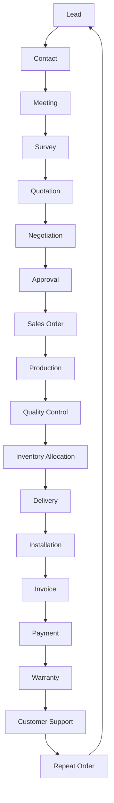
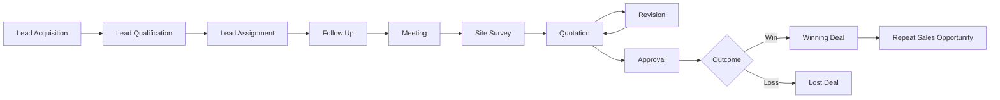
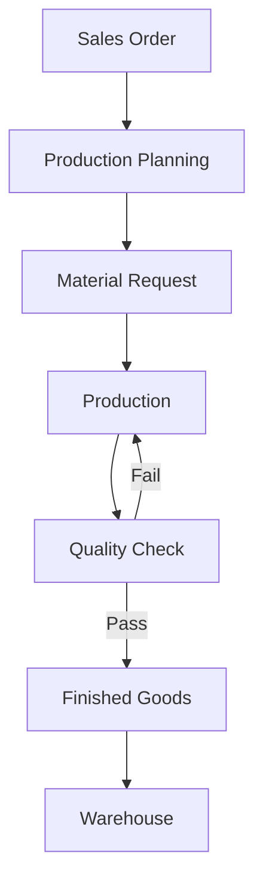
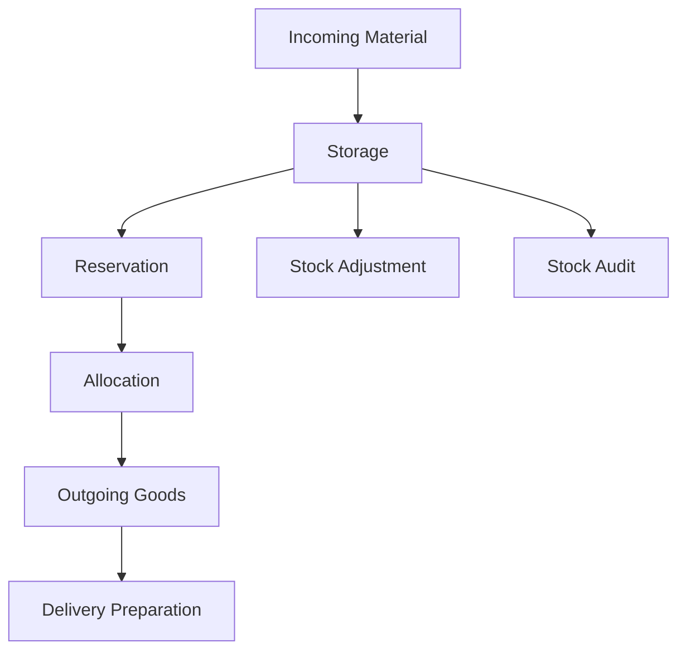
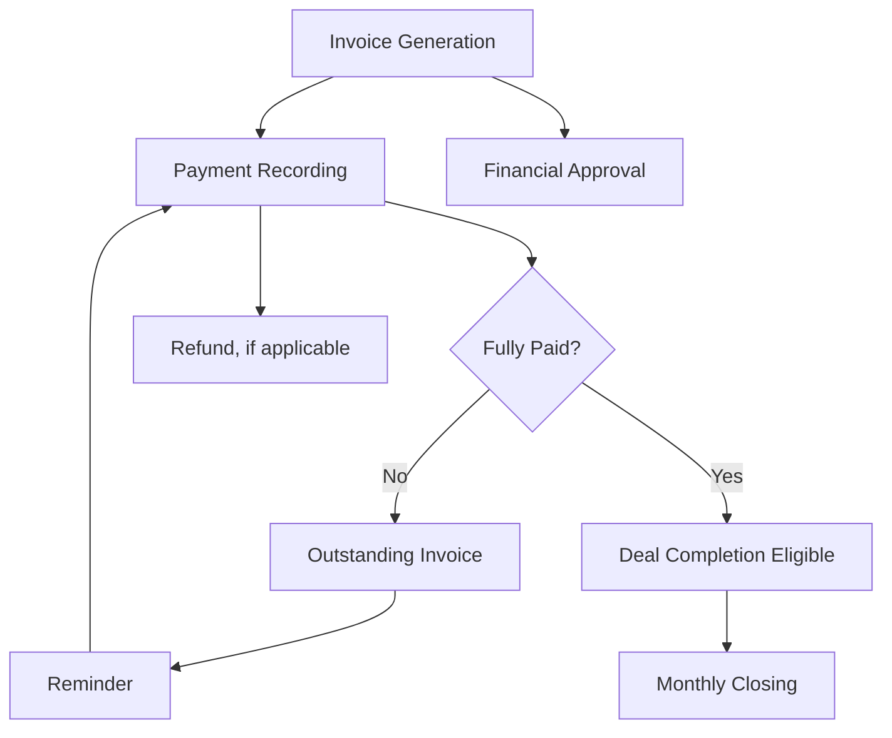
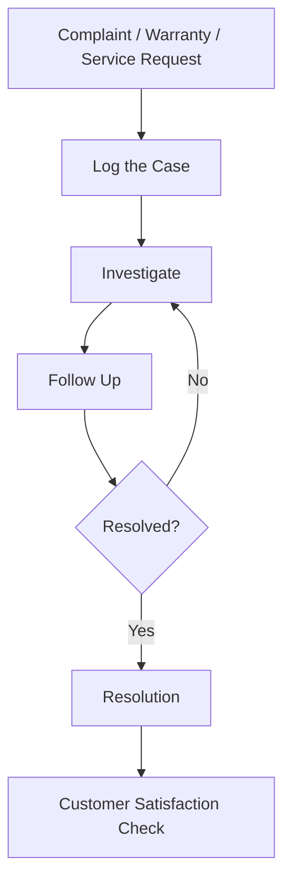
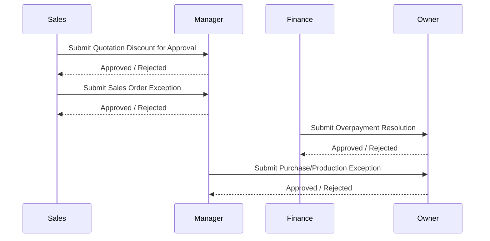

# 11. Business Workflow
## INAKARA CRM — Official Business Workflow Reference

**Status:** Binding — Subordinate to `PROJECT_CONSTITUTION.md` and `01-product-rules.md`; extends `01-product-rules.md` with detailed, operational process flow
**Version:** 1.0.0
**Scope:** This document defines business workflow only — the sequence of business activities, roles, and handoffs inside INAKARA CRM. It contains no database, frontend, or backend implementation detail. Every feature must implement the workflows defined here.

---

## Table of Contents

1. [Introduction](#1-introduction)
2. [User Roles](#2-user-roles)
3. [Complete Customer Journey](#3-complete-customer-journey)
4. [Sales Workflow](#4-sales-workflow)
5. [Production Workflow](#5-production-workflow)
6. [Warehouse Workflow](#6-warehouse-workflow)
7. [Finance Workflow](#7-finance-workflow)
8. [Customer Service Workflow](#8-customer-service-workflow)
9. [Notification Workflow](#9-notification-workflow)
10. [Approval Workflow](#10-approval-workflow)
11. [Branch Workflow](#11-branch-workflow)
12. [Multi-Company Workflow](#12-multi-company-workflow)
13. [Activity Timeline](#13-activity-timeline)
14. [KPI](#14-kpi)
15. [Automation Opportunities](#15-automation-opportunities)
16. [Future Expansion](#16-future-expansion)
17. [Glossary](#17-glossary)
18. [References](#18-references)

---

## 1. Introduction

**Business Goals.** INAKARA CRM exists to help furniture manufacturing and sales organizations convert prospective buyers into satisfied, repeat customers, with every step of that journey — from first contact to after-sales support — visible, accountable, and consistent.

**Business Philosophy.** No sale is complete until the customer has received what they were promised and paid what was agreed. The CRM therefore tracks not just the sale, but production, delivery, installation, and after-sales support as equally important parts of the same business relationship.

**Business Lifecycle.** A customer relationship moves through four broad phases: **Acquisition** (Lead through Won Deal), **Fulfillment** (Sales Order through Delivery/Installation), **Financial Closure** (Invoice through Payment), and **Retention** (Warranty, Support, Repeat Order). Every workflow in this document belongs to one of these four phases.

**Core Business Processes.** The processes governed by this document are: Sales (Section 4), Production (Section 5), Warehouse (Section 6), Finance (Section 7), and Customer Service (Section 8), coordinated through Notification (Section 9) and Approval (Section 10) workflows, and made visible through the Activity Timeline (Section 13) and KPIs (Section 14).

---

## 2. User Roles

| Role | Responsibilities | Permissions (Business-Level) | Daily Activities | Interaction with Other Roles |
|---|---|---|---|---|
| **Owner** | Overall business accountability; strategic oversight of sales, production, and finance. | Full visibility and override authority across all workflows. | Reviews company-wide KPIs (Section 14); approves exceptions escalated by Managers. | Receives escalations from Manager and Finance; sets targets for Sales. |
| **Manager** (Sales Manager) | Pipeline health, team performance, approval of discounts and exceptions. | Approves Quotation exceptions, discount thresholds, and reassignment of Leads/Deals. | Reviews team pipeline; reassigns stalled Leads; approves Quotations beyond Sales authority. | Assigns Leads to Sales; escalates to Owner; coordinates with Production on delivery commitments. |
| **Sales** | Owns individual Leads and Deals from Contact through Sales Order. | Full control of owned Leads/Deals; cannot approve own exceptions. | Follows up on Leads; conducts meetings and surveys; prepares Quotations; negotiates terms. | Requests approval from Manager; coordinates with Production/Warehouse on delivery timing; hands off to Finance at Invoice stage. |
| **Finance** | Invoice issuance, Payment recording, credit control. | Approves overpayment resolution and blacklist changes; issues Invoices. | Issues Invoices; records Payments; sends payment reminders; performs monthly closing. | Receives confirmed Sales Orders from Sales; notifies Sales/Owner of overdue accounts. |
| **Production** | Manufacturing execution against confirmed Sales Orders. | Updates production status; requests materials from Warehouse. | Plans production; requests materials; performs quality checks; hands off finished goods. | Receives Sales Orders from Sales; requests materials from Warehouse; notifies Sales of delays. |
| **Warehouse** (Gudang) | Inventory custody, delivery execution. | Manages stock levels, reservations, and outgoing goods. | Receives materials; allocates stock; prepares and confirms deliveries; performs stock audits. | Supplies Production with materials; coordinates delivery scheduling with Sales/Customer Service. |
| **Customer Service** | Post-sale customer support and issue resolution. | Full read access to Customer history; manages complaints and warranty cases. | Handles complaints; processes warranty claims; follows up on resolution; tracks satisfaction. | Escalates unresolved issues to Manager/Owner; coordinates with Warehouse/Production on service parts or repairs. |
| **Administrator** | System configuration and user management. | Manages users, roles, and system settings. | Onboards new users; configures master data; manages role assignments. | Supports every role with system access issues; coordinates with Owner on role structure changes. |
| **Future Super Admin** | Cross-company oversight in a future multi-company/SaaS context. | Full visibility and configuration authority across all Companies and Branches. | Oversees platform-wide configuration; manages Company onboarding. | Interfaces with each Company's Owner; not part of any single company's day-to-day operation. |

---

## 3. Complete Customer Journey

| Stage | Responsible Role | Input | Output | Possible Status |
|---|---|---|---|---|
| **Lead** | Sales | Prospect contact information from any source | A tracked Lead record | New, Contacted |
| **Contact** | Sales | The Lead's contact information | A logged initial interaction | Contacted, No Response |
| **Meeting** | Sales | A scheduled interaction with the prospect | Understood customer need and context | Scheduled, Completed, No-Show |
| **Survey** | Sales (with Production input for custom items) | The customer's space/requirement detail | A documented specification for quotation | Pending, Completed |
| **Quotation** | Sales | Survey/requirement detail and pricing | A formal price and product proposal | Draft, Sent, Expired, Revised |
| **Negotiation** | Sales, with Manager for exceptions | Customer feedback on the Quotation | Agreed terms or a further revision | In Progress, Agreed, Stalled |
| **Approval** | Manager (for exceptions), Customer | The negotiated terms | Customer commitment to purchase | Pending, Approved, Rejected |
| **Sales Order** | Sales, confirmed by Manager | An approved Quotation | A locked, confirmed order | Confirmed, Cancelled |
| **Production** | Production | A confirmed Sales Order | Manufactured goods | Not Started, In Progress, Completed, Delayed |
| **Quality Control** | Production | Manufactured goods | Goods verified against specification | Passed, Failed, Rework |
| **Inventory Allocation** | Warehouse | Verified finished goods (or ready-stock items) | Goods reserved for a specific Sales Order | Reserved, Allocated |
| **Delivery** | Warehouse | Allocated goods and a delivery schedule | Goods received by the customer | Scheduled, In Transit, Delivered, Failed |
| **Installation** | Warehouse/Production (or a designated installation team) | Delivered goods requiring assembly/installation | An installed, customer-accepted product | Scheduled, Completed, Issue Reported |
| **Invoice** | Finance | A confirmed Sales Order and delivery/installation milestone | A formal payment request | Issued, Partially Paid, Paid, Overdue |
| **Payment** | Finance | Customer funds against an Invoice | A recorded, reconciled payment | Pending, Partial, Paid, Overpaid |
| **Warranty** | Customer Service | A warranty claim against a delivered product | A resolved or in-progress warranty case | Open, In Progress, Resolved, Rejected |
| **Customer Support** | Customer Service | Any post-sale inquiry or issue | A resolved support interaction | Open, In Progress, Resolved |
| **Repeat Order** | Sales, informed by Customer Service history | An existing, satisfied Customer | A new Lead/Deal for that Customer | New Opportunity Identified |

---

## 4. Sales Workflow

- **Lead Acquisition:** Prospects enter the pipeline from any defined source (referral, marketing, walk-in, phone, digital channel, event), captured as a new Lead.
- **Lead Qualification:** Sales confirms genuine need, indicative budget, and buying intent before the Lead is considered Qualified.
- **Lead Assignment:** A Qualified Lead is assigned to exactly one Sales owner, either manually by the Manager or through a defined distribution rule.
- **Follow Up:** Sales maintains scheduled, proactive contact with the Lead, ensuring no opportunity goes cold without action.
- **Meetings:** Sales conducts one or more meetings to understand the customer's requirement in depth.
- **Site Survey:** For furniture requiring custom fit or installation, Sales (often with Production input) conducts a survey of the customer's space to inform accurate specification and quotation.
- **Quotation:** A formal price and product proposal is prepared and sent, based on the survey and discussed requirement.
- **Revision:** The Quotation is revised as needed through negotiation, with every revision retained.
- **Approval:** The customer approves the final terms, or the Manager approves an internal exception (e.g., a discount).
- **Winning Deal:** The Deal is marked Won, triggering Customer creation and Sales Order initiation.
- **Lost Deal:** The Deal is marked Lost with a recorded reason, remaining available for future analysis and potential re-engagement.
- **Repeat Sales:** A satisfied, existing Customer becomes the source of a new Lead/Deal, closing the loop back to Lead Acquisition (Section 3).

---

## 5. Production Workflow

- **Sales Order:** Production work begins only once a Sales Order is confirmed and locked (per `01-product-rules.md` Rule 41).
- **Production Planning:** Production schedules the order against current capacity and other confirmed orders, establishing an expected completion timeline.
- **Material Request:** Production requests the necessary raw materials from Warehouse (Section 6), based on the order's specification.
- **Production:** Manufacturing proceeds according to the plan; status is updated regularly enough that Sales and Customer Service can answer customer inquiries without contacting the production floor directly (per `01-product-rules.md` Rule 42).
- **Quality Check:** Every completed item is verified against its specification before being accepted as finished goods; failed items return to Production for rework.
- **Finished Goods:** Verified items are formally handed off as complete, ready for warehousing and eventual delivery.
- **Warehouse:** Finished goods are received into Warehouse custody (Section 6), closing the Production Workflow and beginning the fulfillment phase.

---

## 6. Warehouse Workflow

- **Incoming Material:** Raw materials (for Production) or finished goods (for ready-stock sales) are received and recorded into inventory.
- **Storage:** Received items are stored and tracked by location and quantity.
- **Reservation:** Stock is reserved against a specific confirmed Sales Order once allocation is anticipated, preventing double-commitment of limited stock.
- **Allocation:** Reserved stock is formally allocated to a specific order once ready for fulfillment.
- **Stock Adjustment:** Discrepancies (damage, loss, correction) are recorded as explicit adjustments, never as silent quantity changes.
- **Outgoing Goods:** Allocated stock is released from inventory as it moves toward delivery.
- **Delivery Preparation:** Goods are prepared, packaged, and staged for the scheduled Delivery stage of the Customer Journey (Section 3).
- **Stock Audit:** Periodic physical verification of recorded stock against actual inventory, ensuring the system's inventory record remains trustworthy over time.

---

## 7. Finance Workflow

- **Invoice Generation:** Finance issues an Invoice against a confirmed Sales Order, per the agreed payment terms (before, during, or after delivery).
- **Payment Recording:** Finance records customer payments against the Invoice, in full or in installments.
- **Outstanding Invoice:** Any Invoice not yet fully paid remains visible as outstanding, tracked against its due date.
- **Reminder:** Finance (supported by automated notification, Section 9) follows up on outstanding Invoices as they approach or pass their due date.
- **Refund:** Where applicable (e.g., an approved cancellation or overpayment), Finance processes a refund, always as an explicit, recorded transaction.
- **Financial Approval:** Certain financial actions (discount exceptions, overpayment resolution, blacklist changes) require explicit Finance or Owner approval before proceeding (Section 10).
- **Monthly Closing:** Finance performs a periodic close, reconciling recorded revenue and outstanding balances for reporting purposes (Section 14).

---

## 8. Customer Service Workflow

- **Complaint:** A customer-reported issue is logged as a distinct, trackable case, referencing the relevant Customer and, where applicable, Sales Order/product.
- **Warranty:** A claim against a delivered product's warranty terms is logged and evaluated against the applicable warranty policy.
- **Service Request:** A customer request for support unrelated to a defect (e.g., a service visit) is logged similarly.
- **Follow Up:** Customer Service maintains active follow-up on open cases until resolution, never leaving a case silently unattended.
- **Resolution:** The case is closed with a recorded outcome, visible in the Customer's full history (per `01-product-rules.md` Section 6.6).
- **Customer Satisfaction:** Where feasible, resolution is followed by a satisfaction check, feeding into Customer Service KPIs (Section 14) and informing future Repeat Order opportunities (Section 3).

---

## 9. Notification Workflow

| Notification | Recipient | Trigger | Priority |
|---|---|---|---|
| Follow-up due/overdue | Lead/Deal owner, then Manager if overdue | Scheduled follow-up date | High |
| Quotation expiring/expired | Lead/Deal owner, Manager | Approaching or passed validity date | Medium |
| Approval requested | Manager, Finance, or Owner (per approval type) | An action requiring approval is submitted (Section 10) | High |
| Task assigned | The assigned user | A task or record ownership is assigned/reassigned | Medium |
| Invoice due soon/overdue | Finance, Sales owner | Approaching or passed due date | High |
| Payment received | Finance, Deal owner | A Payment is recorded | Medium |
| Production delay | Deal owner, Manager | A production milestone is missed | High |
| Production completed | Warehouse, Deal owner | Production marks completion | Medium |
| Delivery scheduled/completed | Sales owner, Warehouse, Customer Service | Delivery milestone reached | Medium |
| Warranty/complaint logged | Customer Service, Manager (for high-severity cases) | A new case is created | High |
| Sales target milestone | Sales, Manager, Owner | A defined target threshold is reached or missed | Medium |

**Reminder System:** Time-based reminders (follow-up, quotation expiry, invoice due) are generated ahead of the relevant deadline, not only once it has passed, giving the responsible role a genuine opportunity to act proactively.

**Priority Levels:** High-priority notifications (approvals, overdue items, production delays) are surfaced with greater visibility/urgency than Medium-priority informational notifications, ensuring the most business-critical items are never lost among routine updates.

---

## 10. Approval Workflow

| Approval Type | Requested By | Approved By |
|---|---|---|
| **Quotation Approval** | Sales | Customer (external); Manager for internal discount exceptions |
| **Discount Approval** | Sales | Manager (beyond standard authority), Owner (beyond Manager's authority) |
| **Purchase Approval** | Production/Warehouse (material purchase) | Manager or Owner, per defined threshold |
| **Payment Approval** | Finance (for refund/overpayment resolution) | Finance lead or Owner |
| **Production Approval** | Production (for exceptions, e.g., expedited scheduling) | Manager |
| **User Approval** | Administrator (new account activation) | Administrator or Owner |
| **Role Approval** | Administrator (role/permission change) | Owner |

**Rule:** No individual approves their own request; every approval workflow routes to a role with genuine, independent authority over that decision, consistent with `01-product-rules.md` Rule 91.

---

## 11. Branch Workflow

- **Multiple Branches:** Each Branch operates its own Sales, Production (where applicable), and Warehouse activity, while remaining part of the same overall Company.
- **Data Isolation:** A Branch's operational data (Leads, Deals, Inventory) is visible primarily to users assigned to that Branch, with cross-branch visibility reserved for Manager/Owner-level roles overseeing multiple branches.
- **Reporting:** Reports can be viewed per Branch or consolidated across all Branches, supporting both local operational management and company-wide oversight.
- **User Assignment:** Every user is assigned to a home Branch (and, where relevant, granted explicit visibility into additional Branches), ensuring Branch-level accountability is always clear.

---

## 12. Multi-Company Workflow

- **Company Isolation:** Each Company's business data, users, and configuration are fully separated from every other Company on the platform, forming the outermost business boundary.
- **Role Isolation:** Roles and permissions are scoped per Company; a user's role in one Company carries no implicit access in another.
- **Data Ownership:** Every business record has a clear, single owning Company, ensuring there is never ambiguity about which organization a given Lead, Deal, or Invoice belongs to.
- **Company Switching:** A user with legitimate access to more than one Company (e.g., a future platform-level Super Admin, or a business owner operating multiple related companies) can switch their active context explicitly, with the system always making clear which Company's data is currently in view.

---

## 13. Activity Timeline

Every business-significant activity across every workflow in this document — a Lead's status change, a Quotation sent, a Production delay, a Payment received, a Complaint resolved — is recorded on the relevant Lead, Deal, or Customer's Activity Timeline, per `01-product-rules.md` Section 10.

- **Audit Trail:** Beyond the business-facing timeline, every change to a core business record is captured in an immutable, attributable Audit Trail (who, when, what changed), per `01-product-rules.md` Section 11.
- **Timeline:** The chronological, human-readable narrative of a Customer or Deal's history, assembled from every workflow stage it has passed through.
- **History:** The permanent, cumulative record supporting both day-to-day Customer Service work (Section 8) and longer-term reporting and analysis (Section 14).
- **Logs:** Security- and system-level events (login, permission changes) are captured distinctly from business activity, per the security standards governing the platform.

---

## 14. KPI

| Role | Key Performance Indicators |
|---|---|
| **Owner** | Company-wide revenue, overall pipeline value, conversion rate, overdue payments, team performance summary. |
| **Sales** | Personal pipeline value, lead response time, Quotation-to-Won conversion rate, quota attainment, follow-up timeliness. |
| **Finance** | Outstanding invoice total, overdue payment aging, cash collected, revenue recognized. |
| **Warehouse** | Delivery on-time rate, stock accuracy (audit variance), pending delivery volume. |
| **Production** | Production throughput, on-time completion rate, rework/quality-check failure rate. |
| **Customer Service** | Case resolution time, open case volume, customer satisfaction rate, warranty claim rate. |

These KPIs correspond directly to the role-based dashboards defined in `01-product-rules.md` Section 12.

---

## 15. Automation Opportunities

| Automation | Business Value |
|---|---|
| **Automatic Reminders** | Ensures follow-ups, quotation expiries, and invoice due dates are never missed due to human oversight alone. |
| **Automatic Status Updates** | Reduces manual status-tracking burden (e.g., automatically marking a Sales Order "Ready for Delivery" once Production and Quality Control both confirm completion). |
| **Automatic Notifications** | Ensures the right role is informed the moment a relevant business event occurs, without relying on manual communication. |
| **Automatic Follow-Up Scheduling** | Proposes the next follow-up action automatically based on the Lead/Deal's current stage, reducing the chance of a stalled opportunity. |
| **Automatic Approval Routing** | Directs an approval request automatically to the correct role based on the type and threshold of the request (Section 10), removing ambiguity about who should act. |

Automation is applied to reduce manual coordination overhead and human error risk — it never replaces the human judgment required for genuine business decisions (approvals, negotiation, exception handling), which remain explicitly role-owned per Section 10.

---

## 16. Future Expansion

These workflows are designed to extend, not be rebuilt, as INAKARA CRM grows into:

- **CRM SaaS:** The Company/Branch structure already defined (Sections 11–12) forms the natural tenant boundary for a multi-tenant SaaS offering.
- **Multiple Companies:** Already addressed structurally in Section 12; onboarding a new Company is a configuration exercise, not a new workflow design.
- **Multiple Warehouses:** Already addressed structurally in Section 6, with Warehouse as a distinct entity from Branch, supporting granular inventory operations as the business scales.
- **Marketplace Integration:** A future marketplace channel becomes an additional Lead Acquisition source (Section 4) feeding the same qualification and sales workflow, without altering the workflow itself.
- **WhatsApp Integration:** Extends the Notification Workflow (Section 9) with an additional delivery channel, without changing what triggers a notification or who receives it.
- **Accounting Integration:** Extends the Finance Workflow (Section 7), synchronizing Invoice and Payment data with an external accounting system while INAKARA CRM remains the operational source of truth for the sales-to-cash process.
- **AI Assistant:** A future AI assistant (e.g., surfacing recommended next follow-up actions, drafting Quotation content, or summarizing a Customer's history) operates as a support layer on top of these existing workflows — assisting the human roles defined in Section 2, never replacing their approval authority (Section 10) or business accountability.

---

## 17. Glossary

| Term | Definition |
|---|---|
| **Customer Journey** | The complete, end-to-end sequence a prospect follows from Lead to Repeat Order (Section 3). |
| **Handoff** | The point at which responsibility for a business process moves from one role to another (e.g., Sales to Production at Sales Order confirmation). |
| **Approval Routing** | The process of directing a request requiring approval to the correct authorized role. |
| **Stock Audit** | A periodic physical verification of recorded inventory against actual stock. |
| **Repeat Order** | A new sales opportunity originating from an existing, previously satisfied Customer. |

## 18. References

- `PROJECT_CONSTITUTION.md` — supreme authority.
- `01-product-rules.md` — the binding business rules this workflow document operationalizes into detailed process flow; where this document introduces additional operational detail (e.g., Meeting, Survey, Installation, Warranty), it is understood as an extension of, and must remain consistent with, `01-product-rules.md` Section 3 (CRM Workflow) and Section 4 (Business Rules).
- `.ai/12-security-rules.md` / `08-security-rules.md` — governs the role-based access underlying every workflow in this document.

---

*End of 11-business-workflow.md — Version 1.0.0*
