# 12. System Design
## INAKARA CRM — Official System Blueprint

**Status:** Binding — Subordinate to `PROJECT_CONSTITUTION.md`, `01-product-rules.md`, `02-design-principles.md`, `03-design-system.md`, `frontend-architecture.md`, `backend-architecture.md`, `06-database-rules.md`, `07-api-standards.md`, `08-security-rules.md`, `09-testing-standards.md`, `10-development-workflow.md`, `11-business-workflow.md`
**Version:** 1.0.0
**Scope:** This document defines the complete logical system architecture — how the entire system works end to end. It is not the frontend architecture, backend architecture, or database rules document individually; it is the synthesis that shows how those pieces fit together. Every module must follow this architecture.

---

## Table of Contents

1. [System Overview](#1-system-overview)
2. [High-Level Architecture](#2-high-level-architecture)
3. [Module Architecture](#3-module-architecture)
4. [System Flow](#4-system-flow)
5. [Data Flow](#5-data-flow)
6. [Role Interaction](#6-role-interaction)
7. [Module Communication](#7-module-communication)
8. [Notification System](#8-notification-system)
9. [File Storage](#9-file-storage)
10. [Audit Trail](#10-audit-trail)
11. [Security Layers](#11-security-layers)
12. [Error Handling](#12-error-handling)
13. [Scalability](#13-scalability)
14. [Third-Party Integration](#14-third-party-integration)
15. [Future AI](#15-future-ai)
16. [Design Principles](#16-design-principles)
17. [Development Roadmap](#17-development-roadmap)
18. [Glossary](#18-glossary)
19. [References](#19-references)

---

## 1. System Overview

**Purpose.** INAKARA CRM is a single, coherent system that runs a furniture business's entire commercial lifecycle — Lead through Repeat Order (`11-business-workflow.md` Section 3) — on one consistent architecture, accessible to every role defined in that document.

**Vision.** The system is built as the first implementation of a future multi-industry, multi-company enterprise CRM platform (`PROJECT_CONSTITUTION.md` Section 14), meaning every architectural decision below is made with that trajectory in mind, not only current furniture-industry needs.

**Architecture.** The system follows a server-driven, monolithic-first architecture (Laravel + Inertia + React) with clean internal layering (`backend-architecture.md` Section 3, `frontend-architecture.md` Section 3), designed so that individual modules can later be extracted or exposed independently (e.g., via REST API, per `07-api-standards.md`) without a fundamental rewrite.

**Scalability.** The system scales along three dimensions simultaneously: data volume, user/team size, and business scope (industries, companies, branches), per `06-database-rules.md` Section 1 and Section 20.

**Maintainability.** Every layer — frontend, backend, database — follows the same feature-first, single-responsibility discipline (`PROJECT_CONSTITUTION.md` Section 9), ensuring the system remains navigable and safely extensible for years.

**Future Expansion.** The system's module boundaries (Section 3), data isolation model (Section 13), and integration patterns (Section 14) are all designed to support SaaS, multi-company, multi-industry, and AI-assisted operation as natural extensions of the current design, not future redesigns.

---

## 2. High-Level Architecture

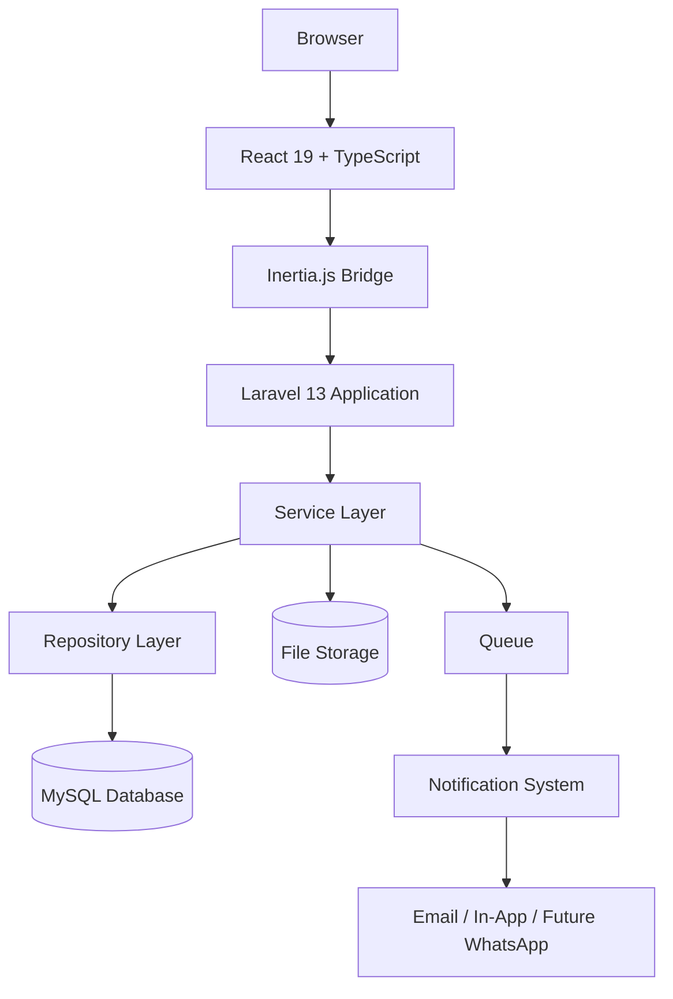

| Layer | Role in the System |
|---|---|
| **Browser** | Renders the client application and captures user interaction. |
| **React 19 + TypeScript** | Builds the interactive UI, per `frontend-architecture.md`, styled per `03-design-system.md`. |
| **Inertia.js Bridge** | Connects React pages directly to Laravel Controllers without a separate API layer for the primary web application, per `07-api-standards.md` Section 2. |
| **Laravel 13 Application** | Hosts routing, Controllers, Form Requests, and the full backend layer architecture, per `backend-architecture.md` Section 3. |
| **Service Layer** | Executes all business logic, per `backend-architecture.md` Section 5, enforcing every rule in `01-product-rules.md`. |
| **Repository Layer** | Executes data access, per `backend-architecture.md` Section 6. |
| **MySQL Database** | Persists all business data, per `06-database-rules.md`. |
| **File Storage** | Persists generated and uploaded files, per Section 9 of this document. |
| **Queue** | Processes asynchronous, non-blocking work, per `backend-architecture.md` Section 14. |
| **Notification System** | Delivers business-relevant notifications across channels, per Section 8 of this document. |

---

## 3. Module Architecture

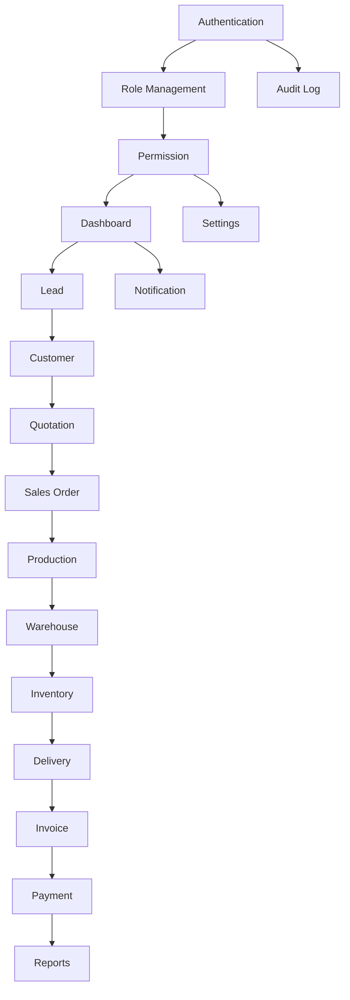

| Module | Responsibility |
|---|---|
| **Authentication** | Verifies user identity and manages session/credential lifecycle, per `08-security-rules.md` Section 2. |
| **Role Management** | Defines the set of business roles and their responsibilities, per `01-product-rules.md` Section 8. |
| **Permission** | Defines fine-grained capabilities beneath roles, per `08-security-rules.md` Section 3. |
| **Dashboard** | Presents role-specific KPIs and priority information, per `01-product-rules.md` Section 12 and `11-business-workflow.md` Section 14. |
| **Lead** | Owns the pre-qualification and qualification stages of the Customer Journey, per `11-business-workflow.md` Section 3–4. |
| **Customer** | The authoritative aggregation point for every relationship a Lead converts into, per `01-product-rules.md` Section 6. |
| **Quotation** | Owns formal pricing proposals and their revisions, per `01-product-rules.md` Section 4.3. |
| **Sales Order** | Owns the locked, confirmed commercial commitment, per `01-product-rules.md` Section 4.5. |
| **Production** | Owns manufacturing execution, per `11-business-workflow.md` Section 5. |
| **Warehouse** | Owns inventory custody and delivery preparation, per `11-business-workflow.md` Section 6. |
| **Inventory** | Owns stock quantity and movement tracking as a ledger, per `06-database-rules.md` Section 14. |
| **Delivery** | Owns fulfillment confirmation, per `01-product-rules.md` Section 4.7. |
| **Invoice** | Owns formal payment requests, per `01-product-rules.md` Section 4.8. |
| **Payment** | Owns recorded fund collection against Invoices, per `01-product-rules.md` Section 4.9. |
| **Reports** | Owns aggregate, historically reproducible business reporting, per `01-product-rules.md` Section 13. |
| **Notification** | Owns cross-cutting event-driven user communication, per Section 8 of this document. |
| **Settings** | Owns system and business configuration, per `06-database-rules.md` Section 13. |
| **Audit Log** | Owns the immutable, cross-cutting record of who changed what, per Section 10 of this document. |

**Module Boundary Principle:** Each module owns its own data and business logic; cross-module interaction happens only through the defined handoffs in Section 7, never through direct, uncontrolled access to another module's internals — mirroring the isolation rule in `frontend-architecture.md` Section 23 and `backend-architecture.md` Section 25.

---

## 4. System Flow

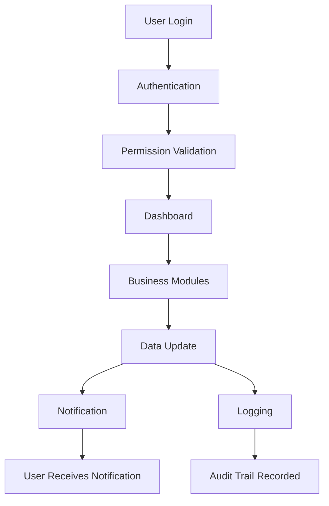

1. **User Login:** The user submits credentials to the Authentication module.
2. **Authentication:** Credentials are verified per `08-security-rules.md` Section 2; a valid session is established.
3. **Permission Validation:** The user's role and permission set is resolved and attached to the session context, per `08-security-rules.md` Section 3.
4. **Dashboard:** The user lands on their role-specific dashboard (Section 3), reflecting only the modules and KPIs relevant to their responsibility.
5. **Business Modules:** The user navigates into a specific module (Lead, Quotation, Invoice, etc.) to perform their work.
6. **Data Update:** An action (create, update, status transition) is submitted, validated, authorized, and processed through the Service layer (`backend-architecture.md` Section 5).
7. **Notification:** Any relevant Event triggers the Notification system (Section 8), informing the appropriate role(s) per `01-product-rules.md` Section 9.
8. **Logging:** The change is simultaneously recorded in the Audit Trail (Section 10), independent of and in addition to the Notification path.

---

## 5. Data Flow

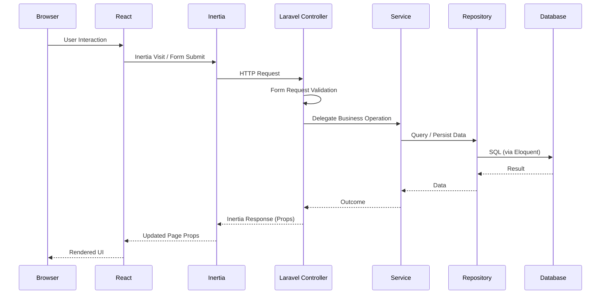

This flow applies uniformly to every module in Section 3; no module bypasses Form Request validation, the Service layer, or the Repository layer, per `backend-architecture.md` Section 3 and Section 25.

---

## 6. Role Interaction

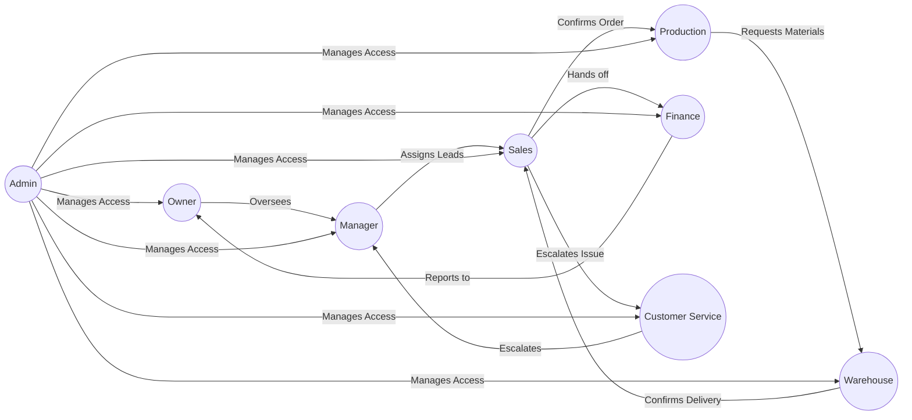

| Role | Broad Permission Scope | Primary Collaboration |
|---|---|---|
| **Owner** | Full visibility, override authority. | Receives escalation from Manager and Finance. |
| **Manager** | Team pipeline, approval authority for exceptions. | Assigns Sales; approves discounts; escalates to Owner. |
| **Sales** | Owned Leads/Deals, standard operational actions. | Hands off to Production (Sales Order) and Finance (Invoice); escalates to Manager. |
| **Finance** | Invoice, Payment, financial reporting. | Receives confirmed orders from Sales; reports financial status to Owner. |
| **Production** | Production execution and status. | Requests materials from Warehouse; reports delays to Sales. |
| **Warehouse** | Inventory and Delivery execution. | Supplies Production; confirms Delivery back to Sales/Customer Service. |
| **Customer Service** | Customer history, complaint/warranty handling. | Escalates unresolved cases to Manager; coordinates with Warehouse/Production on service issues. |
| **Admin** | User and system configuration. | Manages account/role access for every other role. |

This mirrors `11-business-workflow.md` Section 2 and Section 6 in full detail.

---

## 7. Module Communication

| Handoff | Trigger | Data Passed |
|---|---|---|
| **Lead → Customer** | A Deal linked to the Lead is marked Won, per `01-product-rules.md` Rule 1/11. | Contact and qualification history becomes the seed of the new Customer record. |
| **Customer → Quotation** | A new pricing proposal is prepared for the Customer's Deal. | Customer identity and negotiated requirement detail. |
| **Quotation → Sales Order** | The Quotation is approved, per `01-product-rules.md` Rule 35. | Locked pricing, product specification, and quantity. |
| **Sales Order → Production** | The Sales Order is confirmed, per `01-product-rules.md` Rule 41. | Product specification and required completion timeline. |
| **Production → Warehouse** | Finished goods pass Quality Control, per `11-business-workflow.md` Section 5. | Verified, ready-to-store finished goods. |
| **Warehouse → Delivery** | Goods are allocated and staged, per `11-business-workflow.md` Section 6. | Allocated stock and delivery schedule. |
| **Delivery → Invoice** | A delivery milestone relevant to the agreed payment terms is reached, per `01-product-rules.md` Rule 52. | Confirmed delivered (or deliverable) quantity. |
| **Invoice → Payment** | The customer remits funds against the Invoice. | Invoice reference and amount due. |
| **Payment → Reports** | Payment data feeds aggregate financial reporting, per `01-product-rules.md` Section 13. | Reconciled revenue and outstanding balance data. |

**Communication Principle:** Every handoff above is triggered by an Event (`backend-architecture.md` Section 13), decoupling the originating module from the responding module — the Sales Order module does not need to know the internal details of how Production processes its request, only that the Event was successfully raised.

---

## 8. Notification System

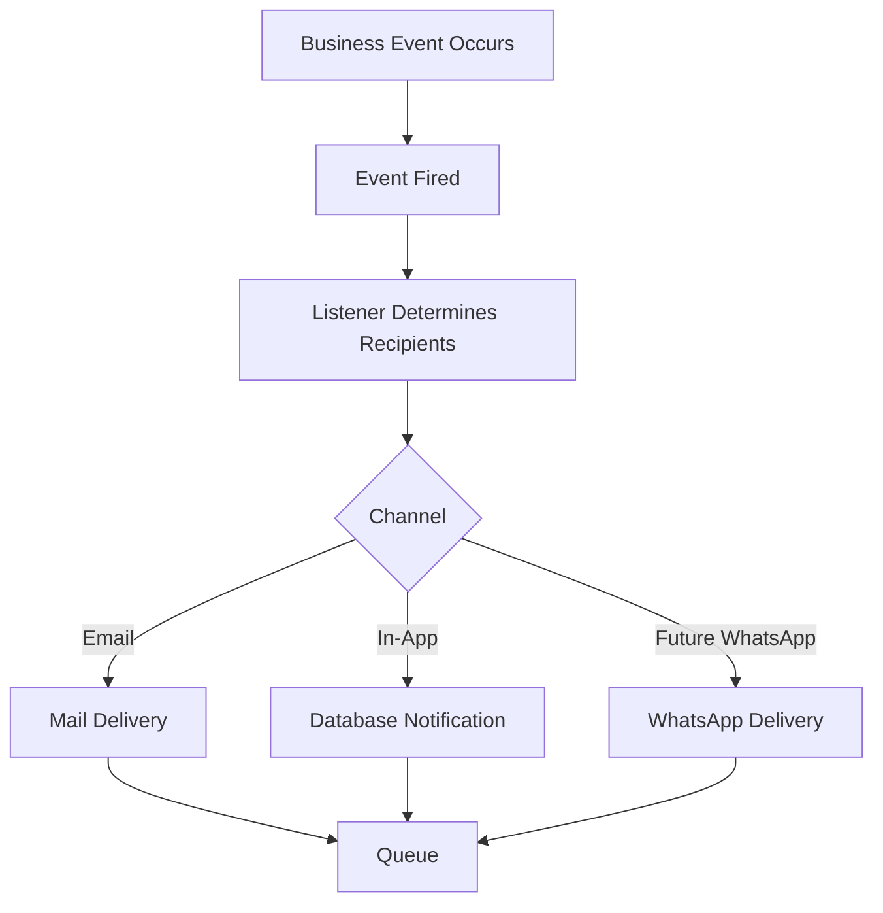

- **Event-Driven Notification:** Every notification originates from a domain Event (`backend-architecture.md` Section 13), never triggered directly and ad hoc from a Controller, ensuring consistent, traceable notification behavior across every module.
- **Email:** Used for durable, formal notifications (Invoice issued, Quotation sent), per `backend-architecture.md` Section 15.
- **In-App:** Used for operational, dashboard-visible notifications (follow-up due, approval requested), per `01-product-rules.md` Section 9.
- **WhatsApp Ready:** The notification architecture is channel-agnostic by design, so WhatsApp can be added as an additional delivery channel for existing notification types without restructuring the system, per `07-api-standards.md` Section 17.
- **Queue Ready:** Every notification is dispatched through the Queue (`backend-architecture.md` Section 14), ensuring notification delivery never blocks the originating business operation's response time.

---

## 9. File Storage

| File Type | Origin | Storage Approach |
|---|---|---|
| **Quotation PDF** | Generated from Quotation data via DomPDF, per `backend-architecture.md` Section 23. | Stored privately, linked to the specific Quotation revision; regenerated only from that exact revision's data. |
| **Invoice PDF** | Generated from Invoice data. | Stored privately, immutable once generated, matching the Invoice's issued state per `01-product-rules.md` Rule 81. |
| **Images** | Product photos, customer attachments. | Validated and stored per `08-security-rules.md` Section 10. |
| **Documents** | General business document attachments (contracts, surveys). | Stored privately by default, access-controlled per the owning record's authorization rules. |
| **Attachments** | Any file attached to a Lead, Customer, Deal, or Case (Customer Service). | Follows the same private-by-default, authorized-access storage approach as all business documents. |

All file storage flows through Laravel's Storage abstraction (`backend-architecture.md` Section 21), keeping the underlying storage backend (local disk today, cloud storage at SaaS scale) swappable without affecting how any module generates or retrieves files.

---

## 10. Audit Trail

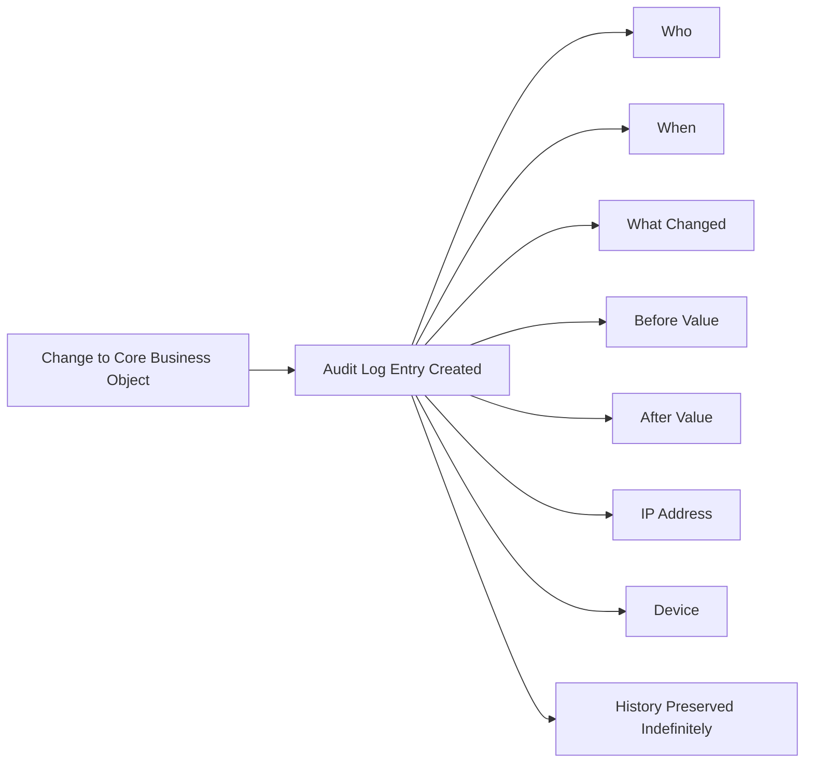

Every change to a core business object (Lead, Customer, Deal, Quotation, Sales Order, Invoice, Payment, and equivalents) produces an immutable Audit Log entry capturing **who** made the change, **when**, **what** changed, the **before** and **after** values, and the **IP address**/**device** context — per `01-product-rules.md` Section 11 and `06-database-rules.md` Section 10. This history is retained indefinitely and is never edited or deleted, forming the permanent, trustworthy record underlying both business dispute resolution and security investigation.

---

## 11. Security Layers

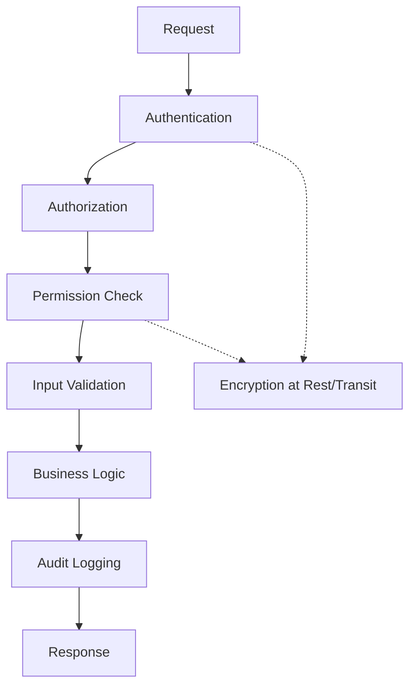

| Layer | Role |
|---|---|
| **Authentication** | Confirms the requester's identity, per `08-security-rules.md` Section 2. |
| **Authorization** | Confirms the identified user is permitted to perform the requested action, per `08-security-rules.md` Section 3. |
| **Permissions** | The fine-grained, dynamically-resolved capability set underlying authorization decisions. |
| **Audit** | Records the change once it is permitted and executed, per Section 10. |
| **Logging** | Captures technical and security-relevant events distinct from business audit data, per `08-security-rules.md` Section 17. |
| **Validation** | Ensures the request's data is structurally and business-rule correct before it affects the system, per `08-security-rules.md` Section 9. |
| **Encryption** | Protects sensitive data at rest and in transit throughout the request lifecycle, per `08-security-rules.md` Section 11. |

Every request passes through this full sequence, in this order, without exception, for every module defined in Section 3.

---

## 12. Error Handling

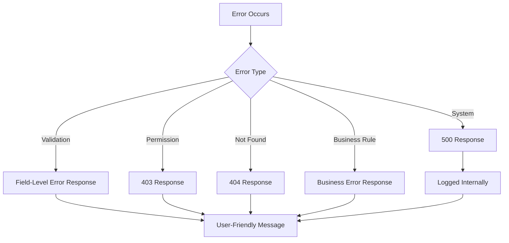

| Error Type | Handling |
|---|---|
| **Validation** | Returned as a field-keyed error structure, per `07-api-standards.md` Section 6, driven by Form Request rules. |
| **Permission** | Returned as a consistent 403 response, per `08-security-rules.md` Section 3. |
| **404** | Returned for genuinely missing resources, distinct from permission denial. |
| **500** | Returned for unexpected system errors, always logged internally, never exposing technical detail to the user, per `08-security-rules.md` Section 22. |
| **Business Errors** | Raised as specific, named exceptions from the Service layer (e.g., "Quotation has expired"), surfaced as a clear, business-meaningful message, per `backend-architecture.md` Section 16. |
| **Logging** | Every error, regardless of type, is logged with sufficient context for diagnosis, per `backend-architecture.md` Section 18, without exposing that detail in the response. |

---

## 13. Scalability

| Dimension | Strategy |
|---|---|
| **Multi Branch** | Branch is a first-class scoping entity across transactional data from the outset, per `06-database-rules.md` Section 15. |
| **Multi Warehouse** | Warehouse is modeled distinctly from Branch, supporting granular inventory operations, per `06-database-rules.md` Section 13. |
| **Multi Company** | Company is the outermost data isolation boundary, forming the natural SaaS tenant boundary, per `06-database-rules.md` Section 15 and `08-security-rules.md` Section 16. |
| **Future SaaS** | Achieved through the combination of Company scoping, industry-neutral core modules (Section 3), and isolated vertical extensions, per `06-database-rules.md` Section 20. |
| **Queue** | Absorbs slow, non-time-critical operations (notifications, exports, imports, PDF generation) away from the synchronous request path, per `backend-architecture.md` Section 14. |
| **Caching** | Applied to aggregate, configuration, and reference data (dashboards, permissions, settings), never to live transactional data, per `backend-architecture.md` Section 20. |
| **Horizontal Scaling** | The stateless application layer (Laravel behind the Queue/Database) can be scaled horizontally as load grows, with the Database and Queue as the primary shared, coordinated resources. |

---

## 14. Third-Party Integration

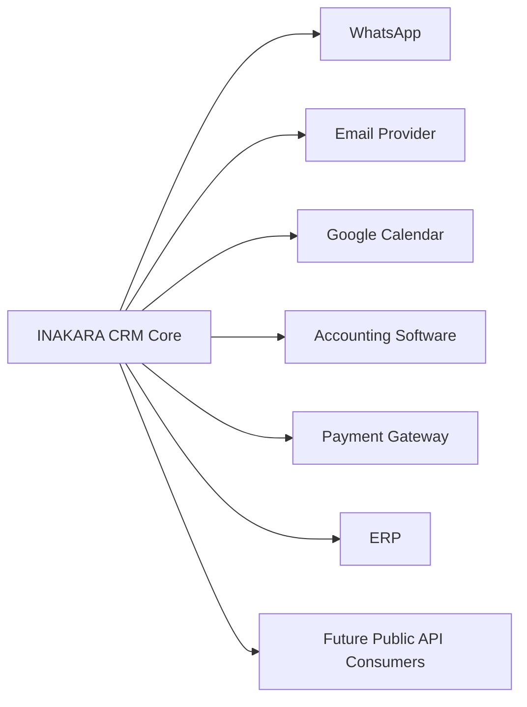

| Integration | Purpose | Architectural Approach |
|---|---|---|
| **WhatsApp** | Notification delivery channel extension, per Section 8. | Plugs into the existing Notification abstraction, per `07-api-standards.md` Section 17. |
| **Email** | Formal, durable notification delivery. | Standard Laravel Notification mail channel. |
| **Google Calendar** | Meeting/survey scheduling synchronization. | A dedicated Service abstraction, isolated from core Sales logic, per `07-api-standards.md` Section 23. |
| **Accounting Software** | Financial data synchronization. | A dedicated integration module, respecting Invoice/Payment immutability rules, per `06-database-rules.md` Section 14. |
| **Payment Gateway** | Payment collection/reconciliation. | A dedicated Service abstraction isolating provider-specific logic from core Payment rules, per `07-api-standards.md` Section 23. |
| **ERP** | Broader operational data synchronization (e.g., inventory, production planning). | Integrated via the Partner API pattern or scheduled sync, per `07-api-standards.md` Section 2. |
| **Future Public API Consumers** | Any external system integrating with INAKARA CRM. | Governed entirely by `07-api-standards.md`, sharing the same Service layer as every internal module. |

**Integration Principle:** Every third-party integration is isolated behind a dedicated Service abstraction; no core business module (Section 3) contains direct, hardcoded logic for a specific external provider, ensuring providers can be added, replaced, or removed without touching core business logic.

---

## 15. Future AI

| AI Capability | System Role |
|---|---|
| **AI Sales Assistant** | Assists Sales with drafting follow-up messages, summarizing a Lead/Deal's history, and suggesting next actions — operating as a support layer reading from existing Lead/Deal/Customer data, never replacing Sales' ownership or the Approval Workflow (`11-business-workflow.md` Section 10). |
| **AI Reporting** | Assists in generating natural-language summaries of existing Report module output (Section 3), never computing figures independently of the authoritative reporting logic. |
| **AI Forecasting** | Analyzes historical pipeline and sales data (already captured per Section 10's Audit Trail and the Report module) to project future trends, presented as an additional insight layer alongside, not a replacement for, standard KPIs (`11-business-workflow.md` Section 14). |
| **AI Lead Scoring** | Analyzes Lead attributes and historical conversion patterns to suggest a priority score, assisting Sales/Manager prioritization decisions without automatically altering Lead ownership or status. |
| **AI Recommendation** | Suggests relevant products, cross-sell, or repeat-order opportunities based on Customer history, surfaced to Sales as a suggestion within the existing Sales Workflow (`11-business-workflow.md` Section 4). |

**AI Integration Principle:** Every future AI capability is additive and advisory — it reads from and enriches the existing modules and workflows defined in this document, and any action it proposes still flows through the same human roles, approval workflow (`11-business-workflow.md` Section 10), and audit trail (Section 10) as any human-initiated action. AI never bypasses authorization or business rule enforcement.

---

## 16. Design Principles

| Principle | Application in This System |
|---|---|
| **Loose Coupling** | Modules (Section 3) interact only through defined Events and handoffs (Section 7), never through direct internal dependency. |
| **High Cohesion** | Each module owns a single, clear business responsibility, per `backend-architecture.md` Section 11 and `frontend-architecture.md` Section 3. |
| **Service Layer** | All business logic is centralized in Services, per `backend-architecture.md` Section 5, ensuring logic is consistent regardless of entry point (Inertia, future REST API). |
| **Repository Pattern** | All complex data access is centralized in Repositories, per `backend-architecture.md` Section 6. |
| **SOLID** | Applied throughout every layer, per `PROJECT_CONSTITUTION.md` Section 9 and `backend-architecture.md` Section 1. |
| **Clean Architecture** | Dependencies point inward — framework and infrastructure concerns never leak into core business rules, per `backend-architecture.md` Section 1. |
| **Reusable Components** | Both frontend (`frontend-architecture.md` Section 4) and backend (Services, Repositories) building blocks are built once and reused across modules, never duplicated. |

These principles are what allow the module architecture in Section 3 to remain stable and extensible as the system grows in scope and scale.

---

## 17. Development Roadmap

```mermaid
gantt
    dateFormat  X
    axisFormat %s
    section Phase 1
    Authentication           :p1a, 0, 1
    Role and Permission      :p1b, after p1a, 1
    Dashboard                :p1c, after p1b, 1
    section Phase 2
    Lead                     :p2a, after p1c, 1
    Customer                 :p2b, after p2a, 1
    Quotation                :p2c, after p2b, 1
    section Phase 3
    Sales Order              :p3a, after p2c, 1
    Production                :p3b, after p3a, 1
    Warehouse                 :p3c, after p3b, 1
    section Phase 4
    Invoice                  :p4a, after p3c, 1
    Payment                  :p4b, after p4a, 1
    Reports                  :p4c, after p4b, 1
    section Phase 5
    Notification              :p5a, after p4c, 1
    Automation                :p5b, after p5a, 1
    AI                        :p5c, after p5b, 1
```

| Phase | Scope | Rationale |
|---|---|---|
| **Phase 1** | Authentication, Role & Permission, Dashboard | Establishes the foundational security and access control layer (Section 11) every subsequent module depends on. |
| **Phase 2** | Lead, Customer, Quotation | Builds the acquisition and early-relationship modules, the entry point of the Customer Journey (`11-business-workflow.md` Section 3). |
| **Phase 3** | Sales Order, Production, Warehouse | Builds the fulfillment chain, converting a Won Deal into delivered goods. |
| **Phase 4** | Invoice, Payment, Reports | Builds financial closure and the reporting layer that depends on complete upstream data. |
| **Phase 5** | Notification, Automation, AI | Builds the cross-cutting communication and intelligence layer on top of a now-complete core system. |

**Roadmap Principle:** Each phase builds only on modules already established in a prior phase, per the Module Communication dependencies in Section 7 — Production is never built before Sales Order, Invoice is never built before Sales Order/Delivery, and Notification/AI are built last because they enrich, rather than enable, the core workflow.

---

## 18. Glossary

| Term | Definition |
|---|---|
| **Module** | A self-contained business capability with a single, clear responsibility (Section 3). |
| **Handoff** | The point at which one module's completed output becomes another module's input (Section 7). |
| **Event-Driven** | An architectural pattern where business occurrences are broadcast as Events, decoupling the originating operation from its downstream reactions. |
| **Tenant Boundary** | The data isolation boundary (Company, in this system) that will define multi-tenant SaaS separation. |
| **Advisory AI** | An AI capability that suggests or enriches, but never autonomously bypasses, human approval and business rule enforcement (Section 15). |

## 19. References

- `PROJECT_CONSTITUTION.md` — supreme authority.
- `01-product-rules.md` — business rules this system architecture implements.
- `11-business-workflow.md` — the detailed operational workflow this system design supports structurally.
- `frontend-architecture.md`, `backend-architecture.md`, `06-database-rules.md` — the detailed layer-specific architectures this document synthesizes.
- `07-api-standards.md`, `08-security-rules.md` — the API and security standards every module and integration in this document must satisfy.

---

*End of 12-system-design.md — Version 1.0.0*
