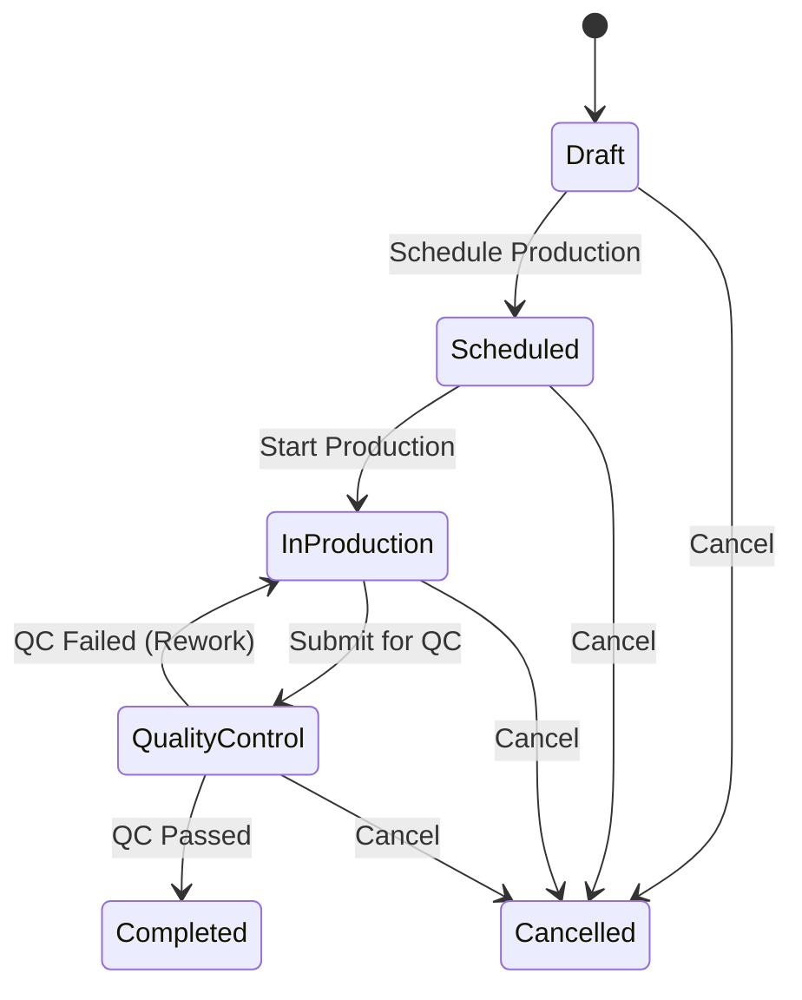

# SPRINT 6 LOCK — Production Order Module

**Status:** Permanently Locked
**Ratified Date:** 2026-07-13
**Applies to:** Sprint 7 and all future sprints of the INAKARA CRM project.

This document serves as the official registry of the locked components of Sprint 6 (Production Order Module). Any future modifications to these components must adhere to the strict rules outlined below.

---

## 1. Frozen Artifacts Registry

### 1.1 Database Schema (Final & Immutable)
The tables below are permanently frozen. No renaming, deletion of columns, or changing of types/relationships is permitted.

*   `production_orders`
*   `production_order_items`
*   `production_order_logs`

*Extension Rule:* Future schema changes may only add nullable columns, indexes, or performance-related optimizations.

### 1.2 State Transition Map & Lifecycle
The status workflow is officially locked to the following sequence:

Any modification to `canTransition()` or the underlying transitions map in the service layer requires explicit business authorization.

### 1.3 Public APIs & Enums
The following Enums and Public API contracts are frozen:
*   `App\Enums\ProductionOrderStatus`
*   `App\Enums\ProductionPriority`
*   `App\Enums\Permission` (Production cases: `view`, `create`, `edit`, `delete`, `cancel`)
*   `App\Services\ProductionOrderService` public API signatures:
    *   `create(array $data, User $creator)`
    *   `update(ProductionOrder $po, array $data, User $updater)`
    *   `transitionStatus(ProductionOrder $po, ProductionOrderStatus $newStatus, User $actor, ?string $note)`
    *   `createFromSalesOrder(SalesOrder $so, User $creator)`
    *   `cancel(ProductionOrder $po, string $reason, User $actor)`
*   TypeScript contracts (`resources/js/types/production-orders.ts`)

---

## 2. Mandatory Rules for Downstream Sprints (Sprint 7+)

1.  **Strict Extension Policy:** All future features (Warehouse, Delivery, Invoice, Payment, Dashboard, and Reports) must extend or integrate with the existing Production Order contracts. Modifying locked codebase files in Sprint 6 is prohibited.
2.  **No Duplicate Logic:** Status checks, metric calculations, and item listings must use the verified scopes (`scopeStatus`, `scopePriority`, `scopeAssigned`, `scopeVisibleTo`, `scopeSearch`) and service methods already implemented in Sprint 6.
3.  **Strict Service-Only Pattern:** Modifying status or transactional data must run through `ProductionOrderService` under `DB::transaction()`. Direct queries or model updates on status are strictly prohibited.
4.  **Zero-Regression Verification:** Every subsequent sprint run must verify compatibility using the existing tests:
    *   `tests/Feature/ProductionOrderServiceTest.php`
    *   `tests/Feature/ProductionOrderControllerTest.php`
    *   `tests/Feature/ProductionOrderPolicyTest.php`
    *   `tests/Feature/ProductionOrderRequestTest.php`
    All validation, controller, request, and policy tests must remain green.
5.  **Boring Over Clever:** Do not introduce new design patterns, abstractions (such as repository, CQRS, DDD context splits), or dependencies in Sprint 7+. Match the existing architectural blueprint exactly.

---

*End of SPRINT_6_LOCK.md — Version 1.0.0*
